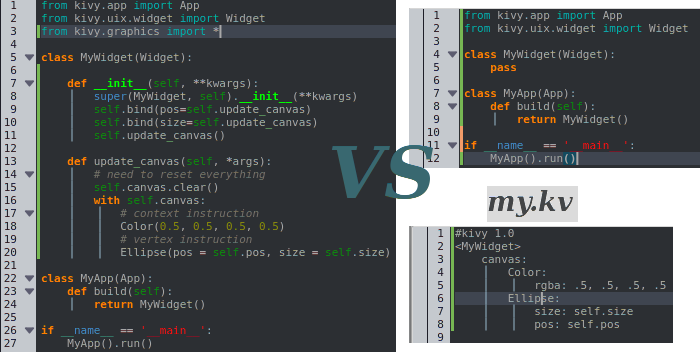

Drawing
-------

Each widget has a canvas, i.e. a place to draw on. The canvas is a group of
drawing instructions that should be executed whenever there is a change to the
widget's graphical representation.

You can add two types of instructions to the canvas: *context* instructions and
*vertex* instructions. You can add instructions either from Python code or from
the kv file (the preferred way).
If you add them via the kv file, the advantage is that they are automatically
updated when any property they depend on changes. In Python, you need to do
this yourself.

In both cases, the canvas of `MyWidget` is re-drawn whenever the ``position``
or the ``size`` of the widget changes.

You can use the
:attr:`canvas.before <kivy.graphics.Canvas.before>` or
:attr:`canvas.after <kivy.graphics.Canvas.after>` groups to separate
your instructions based on when you want them to be executed.

For an in-depth look at how Kivy's graphics are handled, look
:mod:`here <kivy.graphics>`.
