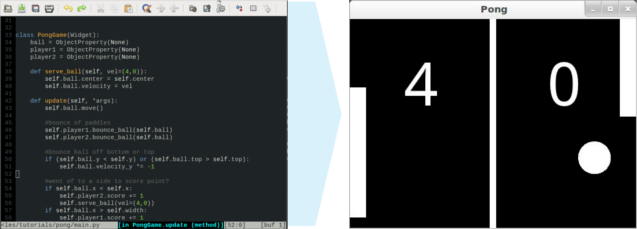

A first App
-----------

.. container:: title

    Jump into the code

Immerse yourself into the world of Kivy with your first App.

The :doc:`/tutorials/pong` introduces the fundamental design patterns and
application development process. As you follow the tutorial, you will create a simple app.
You will also learn how to run your app in on your OS. The simple steps in the tutorial
introduce elegant, useful concepts that you use over and over again in app development.

Your :doc:`/tutorials/pong` is the most important article in the road map. It
lays the foundation for the concepts that you will learn more about later. Each
of the other articles expands on one of those concepts.

