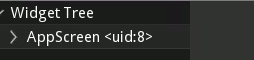

Non-widget stuff
-----------------

.. |animation_text| replace:: :class:`Animation <kivy.animation.Animation>` is
    used to change a widget's properties (size/pos/center etc.) to a target
    value within a target time.
    Various :class:`transition <kivy.animation.AnimationTransition>` functions
    are provided. You can use them to animate widgets and build very smooth UI
    behaviours.

.. |atlas_text| replace:: :class:`Atlas <kivy.atlas.Atlas>` is a class for
    managing texture maps, i.e. packing multiple textures into one image.
    This allows you to reduce the number of images loaded and thus speed up the
    application start.

.. |clock_text| replace:: :class:`Clock <kivy.clock.Clock>` provides you with a
    convenient way to schedule jobs at set time intervals and is preferred
    over `sleep()`,  which would block the kivy event loop. These intervals can
    be set relative to the OpenGL drawing instructions,
    :ref:`before <schedule-before-frame>` or
    :ref:`after <schedule-before-frame>`. The Clock also provides you with a way
    to create :ref:`triggered events <triggered-events>` that are grouped
    together and called only once before the next frame.

.. |sched_once| replace:: :meth:`~kivy.clock.ClockBase.schedule_once`
.. |sched_intrvl| replace:: :meth:`~kivy.clock.ClockBase.schedule_interval`
.. |unsched| replace:: :meth:`~kivy.clock.ClockBase.unschedule`
.. |trigger| replace:: :meth:`~kivy.clock.ClockBase.create_trigger`
.. |urlreq| replace:: :class:`UrlRequest <kivy.network.urlrequest.UrlRequest>`
    is useful for asynchronous requests that do not block the event loop, and
    manage the result and progress with callbacks.

+------------------+------------------+
| |animation_text| |   |animation_img||
+------------------+------------------+
| |atlas_text|     |     |atlas_img|  |
+------------------+------------------+
| |clock_text|     | - |sched_once|   |
|                  | - |sched_intrvl| |
|                  | - |unsched|      |
|                  | - |trigger|      |
+------------------+------------------+
| |urlreq|         |                  |
+------------------+------------------+
