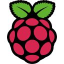

Installation
------------

With Kivy, you can use your favourite development environment to start
coding your App. To get started, you need to download the latest version of
Kivy:

    http://kivy.org/#download

After downloading, please refer to the installation instructions for your
specific platform:

.. image:: ../images/windows.png
    :alt: Windows
    :target: ../installation/installation-windows.html
    :class: gs-osimage

.. image:: ../images/macosx.png
    :alt: OS X
    :target: ../installation/installation-osx.html
    :class: gs-osimage

.. image:: ../images/linux.png
    :alt: Linux
    :target: ../installation/installation-linux.html
    :class: gs-osimage gs-osimage-last

Development Version
~~~~~~~~~~~~~~~~~~~

If you want the development version of Kivy in order to benefit from the latest
additions to the framework, you can get the
`source code <https://github.com/kivy/kivy>`_ from github_::

    git clone http://github.com/kivy/kivy

Take a look at our instructions for installing the :ref:`installation_devel`.

.. _github: https://github.com/
