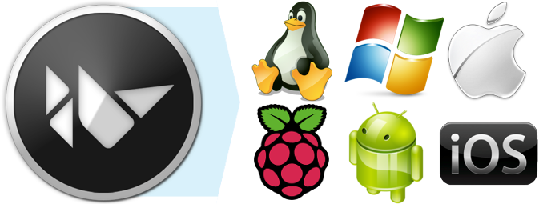

Introduction
============

Start Developing Kivy Apps right away!
--------------------------------------

Creating Kivy apps is fun and enriching. If you're a new developer, this guide
provides the perfect starting point for app development.

On your computer, you can create apps that run on:

- Desktop computer: MacOSX, Linux, Windows.
- iOs Devices: iPad, iPhone
- Android devices: Tablets, Phones.
- And any others touch enabled professional/homebrew devices supporting TUIO.

(?) kivy empowers you with the freedom of writing your code once and having it run as is on different platforms.

Follow this guide to get the tools you need, understand the major concepts and
best practices, as this is an introduction, pointers will be provided at the
end of each section to find more information.

As you proceed through the guide, you will, using Kivy SDK:

- **Learn**: The basics of programming with the Kivy language.
- **Explore**: The Kivy framework.
- **Create**:  simple cross-platform app.
- **Package**: for your choice of platform.

Finally, you will learn how to **Deploy** on a device of your choice.

Each section of the guide introduces a new topic trying to give you enougth
information to get started and links to related articles for more in-depth
explanations. When you are done with this guide, you'll be able to develop
Kivy app and will know where to look for informations for the more challenging
stuff your innovative applications will require.

But enought with introduction, let't get in business.
