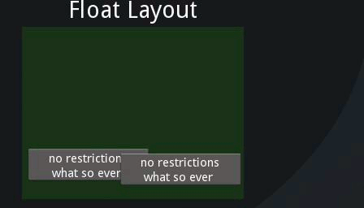

Layouts
--------

.. container:: title

    Arranging Your Widgets

Layouts are used to arrange widgets in a perticular manner. ::

    AnchorLayout:   widgets can be anchored to 'top', 'bottom', 'left', 'right'
    BoxLayout:      widgets arranged in a box either in 'vertical' or 'horizontal' orientation
    FloatLayout:    Widgets are essentially unrestricted
    GridLayout:     widgets arranged in grids of rows and columns defined by ``rows`` and ``cols`` properties
    StackLayout:    widgets are stacked in ``lr-tp`` (left to right then top to bottom) or ``tp-lr``

**Size_hint**: defines the size of a widget in parent space in percentages, values restricted to range 0 - 1 i.e. 0.01 = 1% and 1. = 100%.

Eg. ::

     widget.size_hint_x = .5

sets the width of  the widget to 50% of free space in parent.

Consider widgets w1, w2, w3

w1.size_hint_x =  1, w2.size_hint_x =  1, w3.size_hint_x = 1 ::

        [(111111111111)]<-parent width = 12
               w1
    width:     12

        [(1111)(1111)(1111)]<-parent width = 12
           w1    w2    w3
    width:  4     4     4

w2.size_hint_x = .5 ::

        [(11111)(11)(11111)]<-parent width: 12
            w1   w2    w3
    width:  5    2     5

w2.size_hint_x = 2 ::

        [(11)(11111111)(11)]<-parent width: 12
          w1     w2     w3
    width: 2      8      2

The above notation doesn't work on float layouts. There widgets size when set using size_hint is not dependent on it's sibblings sizes.

size_hint_x or size_hint_y is used to calculate widget's size only if the value/s are not set to None.

Layout illustrations:

.. image:: ../images/anchorlayout.gif
        :alt: AnchorLayout illustration
        :class: gs-layoutimage

.. image:: ../images/boxlayout.gif
        :alt: AnchorLayout illustration
        :class: gs-layoutimage

.. image:: ../images/gridlayout.gif
        :alt: AnchorLayout illustration
        :class: gs-layoutimage

.. image:: ../images/stacklayout.gif
        :alt: AnchorLayout illustration
        :class: gs-layoutimage
