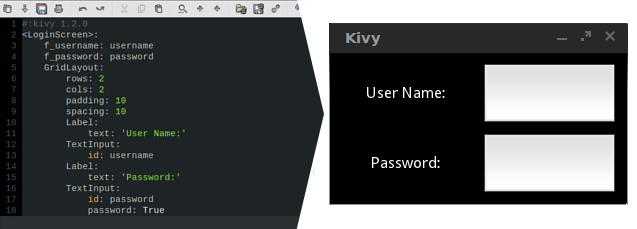

Kv Design Language
------------------

Kivy provides a design language specifically geared towards easy and scalable
GUI Design. The language makes it simple to separate the interface design from
the application logic, adhering to the
`separation of concerns principle
<http://en.wikipedia.org/wiki/Separation_of_concerns>`_. For example:

In the above code :

.. code-block:: kv

    <LoginScreen>:  # every class in your app can be represented by a rule like
                    # this in the kv file
        GridLayout: # this is how you add your widget/layout to the parent
                    # (note the indentation).
            rows: 2 # this how you set each property of your widget/layout

That's it, that's how simple it is to design your GUI in the Kv language. For
a more in-depth understanding, please refer to the :doc:`/guide/lang`
documentation.
