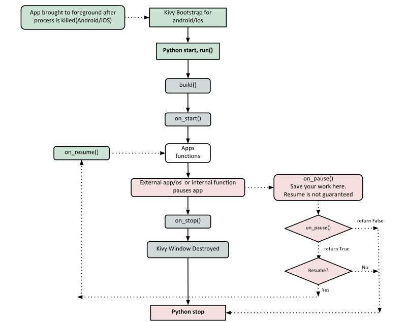

.. _basic:

Kivy Basics
===========

Installation of the Kivy environment
------------------------------------

Kivy depends on many libraries, such as SDL2, gstreamer, PIL,
Cairo, and more. They are not all required, but depending on the
platform you're working on, they can be a pain to install. To ease your
development process, we provide pre-packaged binaries for Windows, macOS and Linux.

Have a look at one of these pages for detailed installation instructions:

* :ref:`installation_windows`
* :ref:`installation_osx`
* :ref:`installation_linux`
* :ref:`installation_bsd`
* :ref:`installation_rpi`

Alternatively, instructions for the development version can be found here:

* :ref:`kivy-dev-install`

.. _quickstart:

Create an application
---------------------

Creating a kivy application is as simple as:

- sub-classing the :class:`~kivy.app.App` class
- implementing its :meth:`~kivy.app.App.build` method so it returns a
  :class:`~kivy.uix.Widget` instance (the root of your widget tree)
- instantiating this class, and calling its :meth:`~kivy.app.App.run`
  method.

Here is an example of a minimal application::

    import kivy
    kivy.require('2.1.0') # replace with your current kivy version !

    from kivy.app import App
    from kivy.uix.label import Label

    class MyApp(App):

        def build(self):
            return Label(text='Hello world')

    if __name__ == '__main__':
        MyApp().run()

You can save this to a text file, `main.py` for example, and run it.

Kivy App Life Cycle
-------------------

First off, let's get familiar with the Kivy app life cycle.

As you can see above, for all intents and purposes, our entry point into our App
is the run() method, and in our case that is "MyApp().run()". We will get back
to this, but let's start from the line::

    from kivy.app import App

It's required that the base Class of your App inherits from the `App` class.
It's present in the kivy_installation_dir/kivy/app.py.

.. Note::
    Go ahead and open up that file if you want to delve deeper into what the
    Kivy App class does. We encourage you to open the code and read through it.
    Kivy is based on Python and uses Sphinx for documentation, so the
    documentation for each class is in the actual file.

Similarly on line 5::

    from kivy.uix.label import Label

One important thing to note here is the way packages/classes are laid out. The
:class:`~kivy.uix` module is the section that holds the user interface elements
like layouts and widgets.

Moving on to line 8::

    class MyApp(App):

This is where we are `defining` the Base Class of our Kivy App. You should only
ever need to change the name of your app `MyApp` in this line.

Further on to line 10::

    def build(self):

As highlighted by the image above, showcasing the `Kivy App Life Cycle`, this
is the function where you should initialize and return your `Root Widget`. This
is what we do on line 11::

    return Label(text='Hello world')

Here we initialize a Label with text 'Hello World' and return its instance.
This Label will be the Root Widget of this App.

.. Note::
    Python uses indentation to denote code blocks, therefore take note that in
    the code provided above, at line 11 the class and function definition ends.

Now on to the portion that will make our app run at line 14 and 15::

    if __name__ == '__main__':
        MyApp().run()

Here the class `MyApp` is initialized and its run() method called. This
initializes and starts our Kivy application.

Running the application
-----------------------
To run the application, follow the instructions for your operating system:

For Windows, Linux, macOS, or the RPi. From the :ref:`terminal<command-line>`
where you installed Kivy simply run::

    python main.py

For Android or iOS, your application needs some complementary files to be able to run.
See :doc:`/guide/packaging-android` or See :doc:`/guide/packaging-ios` for further reference.

A window should open, showing a single Label (with the Text 'Hello World') that
covers the entire window's area. That's all there is to it.

Customize the application
-------------------------

Lets extend this application a bit, say a simple UserName/Password page.

.. code-block:: python

    from kivy.app import App
    from kivy.uix.gridlayout import GridLayout
    from kivy.uix.label import Label
    from kivy.uix.textinput import TextInput

    class LoginScreen(GridLayout):

        def __init__(self, **kwargs):
            super(LoginScreen, self).__init__(**kwargs)
            self.cols = 2
            self.add_widget(Label(text='User Name'))
            self.username = TextInput(multiline=False)
            self.add_widget(self.username)
            self.add_widget(Label(text='password'))
            self.password = TextInput(password=True, multiline=False)
            self.add_widget(self.password)

    class MyApp(App):

        def build(self):
            return LoginScreen()

    if __name__ == '__main__':
        MyApp().run()

At line 2 we import a :class:`~kivy.uix.gridlayout.Gridlayout`::

    from kivy.uix.gridlayout import GridLayout

This class is used as a Base for our Root Widget (LoginScreen) defined
at line 7::

    class LoginScreen(GridLayout):

At line 9 in the class LoginScreen, we override the method
:meth:`~kivy.widget.Widget.__init__` so as to add widgets and to define their
behavior::

    def __init__(self, **kwargs):
        super(LoginScreen, self).__init__(**kwargs)

One should not forget to call super in order to implement the functionality of
the original class being overloaded. Also note that it is good practice not to
omit the `**kwargs` while calling super, as they are sometimes used internally.

Moving on to Line 11 and beyond::

    self.cols = 2
    self.add_widget(Label(text='User Name'))
    self.username = TextInput(multiline=False)
    self.add_widget(self.username)
    self.add_widget(Label(text='password'))
    self.password = TextInput(password=True, multiline=False)
    self.add_widget(self.password)

We ask the GridLayout to manage its children in two columns and add a
:class:`~kivy.uix.label.Label` and a :class:`~kivy.uix.textinput.TextInput`
for the username and password.

Running the above code will give you a window that should look like this:

Try re-sizing the window and you will see that the widgets on screen adjust
themselves according to the size of the window without you having to do
anything. This is because widgets use size hinting by default.

The code above doesn't handle the input from the user, does no validation or
anything else. We will delve deeper into this and :class:`~kivy.widget.Widget`
size and positioning in the coming sections.
