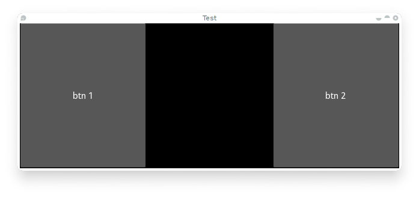

.. _events:
.. _properties:

Events and Properties
=====================

Events are an important part of Kivy programming. That may not be surprising to
those with GUI development experience, but it's an important concept for
newcomers. Once you understand how events work and how to bind to them, you
will see them everywhere in Kivy. They make it easy to build whatever behavior
you want into Kivy.

The following illustration shows how events are handled in the Kivy framework.

.. image:: images/Events.*

Introduction to the Event Dispatcher
------------------------------------

One of the most important base classes of the framework is the
:class:`~kivy.event.EventDispatcher` class. This class allows you to register
event types, and to dispatch them to interested parties (usually other event
dispatchers). The :class:`~kivy.uix.widget.Widget`,
:class:`~kivy.animation.Animation` and :obj:`~kivy.clock.Clock` classes are
examples of event dispatchers.

EventDispatcher objects depend on the main loop to generate and
handle events.

Main loop
---------

As outlined in the illustration above, Kivy has a `main loop`. This loop is
running during all of the application's lifetime and only quits when exiting
the application.

Inside the loop, at every iteration, events are generated from user input,
hardware sensors or a couple of other sources, and frames are rendered to the
display.

Your application will specify callbacks (more on this later), which are called
by the main loop. If a callback takes too long or doesn't quit at all, the main
loop is broken and your app doesn't work properly anymore.

In Kivy applications, you have to avoid long/infinite loops or sleeping.
For example the following code does both::

    while True:
        animate_something()
        time.sleep(.10)

When you run this, the program will never exit your loop, preventing Kivy from
doing all of the other things that need doing. As a result, all you'll see is a
black window which you won't be able to interact with. Instead, you need to
"schedule" your ``animate_something()`` function to be called repeatedly.

Scheduling a repetitive event
~~~~~~~~~~~~~~~~~~~~~~~~~~~~~~

You can call a function or a method every X times per second using
:meth:`~kivy.clock.Clock.schedule_interval`. Here is an example of calling a
function named my_callback 30 times per second::

    def my_callback(dt):
        print('My callback is called', dt)
    event = Clock.schedule_interval(my_callback, 1 / 30.)

You have multiple ways of unscheduling a previously scheduled event. One, is
to use :meth:`~kivy.clock.ClockEvent.cancel` or :meth:`~kivy.clock.Clock.unschedule`::

    event.cancel()

or::

    Clock.unschedule(event)

Alternatively, you can return False in your callback, and your event will be automatically
unscheduled::

    count = 0
    def my_callback(dt):
        global count
        count += 1
        if count == 10:
            print('Last call of my callback, bye bye !')
            return False
        print('My callback is called')
    Clock.schedule_interval(my_callback, 1 / 30.)

Scheduling a one-time event
~~~~~~~~~~~~~~~~~~~~~~~~~~~~~~~~~

Using :meth:`~kivy.clock.Clock.schedule_once`, you can call a function "later",
like in the next frame, or in X seconds::

    def my_callback(dt):
        print('My callback is called !')
    Clock.schedule_once(my_callback, 1)

This will call ``my_callback`` in one second. The second argument is the amount
of time to wait before calling the function, in seconds. However, you can
achieve some other results with special values for the second argument:

- If X is greater than 0, the callback will be called in X seconds
- If X is 0, the callback will be called after the next frame
- If X is -1, the callback will be called before the next frame

The -1 is mostly used when you are already in a scheduled event, and if you
want to schedule a call BEFORE the next frame is happening.

A second method for repeating a function call is to first schedule a callback once
with :meth:`~kivy.clock.Clock.schedule_once`, and a second call to this function
inside the callback itself::

    def my_callback(dt):
        print('My callback is called !')
        Clock.schedule_once(my_callback, 1)
    Clock.schedule_once(my_callback, 1)

.. warning::
    While the main loop will try to keep to the schedule as requested, there is some
    uncertainty as to when exactly a scheduled callback will be called. Sometimes
    another callback or some other task in the application will take longer than
    anticipated and thus the timing can be a little off.

In the latter solution to the repetitive callback problem, the next iteration will
be called at least one second after the last iteration ends. With
:meth:`~kivy.clock.Clock.schedule_interval` however, the callback is called
every second.

Trigger events
~~~~~~~~~~~~~~

Sometimes you may want to schedule a function to be called only once for the next 
frame, preventing duplicate calls. You might be tempted to achieve that like so::

    # First, schedule once.
    event = Clock.schedule_once(my_callback, 0)
    
    # Then, in another place you will have to unschedule first
    # to avoid duplicate call. Then you can schedule again.
    Clock.unschedule(event)
    event = Clock.schedule_once(my_callback, 0)

This way of programming a trigger is expensive, since you'll always call
unschedule, even if the event has already completed. In addition, a new event is
created every time. Use a trigger instead::

    trigger = Clock.create_trigger(my_callback)
    # later
    trigger()

Each time you call trigger(), it will schedule a single call of your callback. If
it was already scheduled, it will not be rescheduled.

Widget events
-------------

A widget has 2 default types of events:

- Property event: if your widget changes its position or size, an event is fired.
- Widget-defined event: e.g. an event will be fired for a Button when it's pressed or
  released.

For a discussion on how widget touch events are managed and propagated, please refer
to the :ref:`Widget touch event bubbling <widget-event-bubbling>` section.

Creating custom events
----------------------

To create an event dispatcher with custom events, you need to register the name
of the event in the class and then create a method of the same name.

See the following example::

    class MyEventDispatcher(EventDispatcher):
        def __init__(self, **kwargs):
            self.register_event_type('on_test')
            super(MyEventDispatcher, self).__init__(**kwargs)

        def do_something(self, value):
            # when do_something is called, the 'on_test' event will be
            # dispatched with the value
            self.dispatch('on_test', value)

        def on_test(self, *args):
            print("I am dispatched", args)

Attaching callbacks
-------------------

To use events, you have to bind callbacks to them. When the event is
dispatched, your callbacks will be called with the parameters relevant to
that specific event.

A callback can be any python callable, but you need to ensure it accepts
the arguments that the event emits. For this, it's usually safest to accept the
`*args` argument, which will catch all arguments in the `args` list.

Example::

    def my_callback(value, *args):
        print("Hello, I got an event!", args)

    ev = MyEventDispatcher()
    ev.bind(on_test=my_callback)
    ev.do_something('test')

Pleases refer to the :meth:`kivy.event.EventDispatcher.bind` method
documentation for more examples on how to attach callbacks.

Introduction to Properties
--------------------------

Properties are an awesome way to define events and bind to them. Essentially,
they produce events such that when an attribute of your object changes,
all properties that reference that attribute are automatically updated.

There are different kinds of properties to describe the type of data you want to
handle.

- :class:`~kivy.properties.StringProperty`
- :class:`~kivy.properties.NumericProperty`
- :class:`~kivy.properties.BoundedNumericProperty`
- :class:`~kivy.properties.ObjectProperty`
- :class:`~kivy.properties.DictProperty`
- :class:`~kivy.properties.ListProperty`
- :class:`~kivy.properties.OptionProperty`
- :class:`~kivy.properties.AliasProperty`
- :class:`~kivy.properties.BooleanProperty`
- :class:`~kivy.properties.ReferenceListProperty`

Declaration of a Property
-------------------------

To declare properties, you must declare them at the class level. The class will then do
the work to instantiate the real attributes when your object is created. These properties
are not attributes: they are mechanisms for creating events based on your
attributes::

    class MyWidget(Widget):

        text = StringProperty('')

When overriding `__init__`, *always* accept `**kwargs` and use `super()` to call
the parent's `__init__` method, passing in your class instance::

        def __init__(self, **kwargs):
            super(MyWidget, self).__init__(**kwargs)

Dispatching a Property event
----------------------------

Kivy properties, by default, provide an `on_<property_name>` event. This event is
called when the value of the property is changed.

.. note::
    If the new value for the property is equal to the current value, then the
    `on_<property_name>` event will not be called.

For example, consider the following code:

.. code-block:: python
   :linenos:

    class CustomBtn(Widget):

        pressed = ListProperty([0, 0])

        def on_touch_down(self, touch):
            if self.collide_point(*touch.pos):
                self.pressed = touch.pos
                return True
            return super(CustomBtn, self).on_touch_down(touch)

        def on_pressed(self, instance, pos):
            print('pressed at {pos}'.format(pos=pos))

In the code above at line 3::

    pressed = ListProperty([0, 0])

We define the `pressed` Property of type :class:`~kivy.properties.ListProperty`,
giving it a default value of `[0, 0]`. From this point forward, the `on_pressed`
event will be called whenever the value of this property is changed.

At Line 5::

    def on_touch_down(self, touch):
        if self.collide_point(*touch.pos):
            self.pressed = touch.pos
            return True
        return super(CustomBtn, self).on_touch_down(touch)

We override the :meth:`on_touch_down` method of the Widget class. Here, we check
for collision of the `touch` with our widget.

If the touch falls inside of our widget, we change the value of `pressed` to touch.pos
and return True, indicating that we have consumed the touch and don't want it to
propagate any further.

Finally, if the touch falls outside our widget, we call the original event
using `super(...)` and return the result. This allows the touch event propagation
to continue as it would normally have occurred.

Finally on line 11::

    def on_pressed(self, instance, pos):
        print('pressed at {pos}'.format(pos=pos))

We define an `on_pressed` function that will be called by the property whenever the
property value is changed.

.. Note::
    This `on_<prop_name>` event is called within the class where the property is
    defined. To monitor/observe any change to a property outside of the class
    where it's defined, you should bind to the property as shown below.

**Binding to the property**

How to monitor changes to a property when all you have access to is a widget
instance? You *bind* to the property::

    your_widget_instance.bind(property_name=function_name)

For example, consider the following code:

.. code-block:: python
   :linenos:

    class RootWidget(BoxLayout):

        def __init__(self, **kwargs):
            super(RootWidget, self).__init__(**kwargs)
            self.add_widget(Button(text='btn 1'))
            cb = CustomBtn()
            cb.bind(pressed=self.btn_pressed)
            self.add_widget(cb)
            self.add_widget(Button(text='btn 2'))

        def btn_pressed(self, instance, pos):
            print('pos: printed from root widget: {pos}'.format(pos=.pos))

If you run the code as is, you will notice two print statements in the console.
One from the `on_pressed` event that is called inside the `CustomBtn` class and
another from the `btn_pressed` function that we bind to the property change.

The reason that both functions are called is simple. Binding doesn't mean
overriding. Having both of these functions is redundant and you should generally
only use one of the methods of listening/reacting to property changes.

You should also take note of the parameters that are passed to the
`on_<property_name>` event or the function bound to the property.

.. code-block:: python

    def btn_pressed(self, instance, pos):

The first parameter is `self`, which is the instance of the class where this
function is defined. You can use an in-line function as follows:

.. code-block:: python
   :linenos:

    cb = CustomBtn()

    def _local_func(instance, pos):
        print('pos: printed from root widget: {pos}'.format(pos=pos))

    cb.bind(pressed=_local_func)
    self.add_widget(cb)

The first parameter would be the `instance` of the class the property is
defined.

The second parameter would be the `value`, which is the new value of the property.

Here is the complete example, derived from the snippets above, that you can
use to copy and paste into an editor to experiment.

.. code-block:: python
   :linenos:

    from kivy.app import App
    from kivy.uix.widget import Widget
    from kivy.uix.button import Button
    from kivy.uix.boxlayout import BoxLayout
    from kivy.properties import ListProperty

    class RootWidget(BoxLayout):

        def __init__(self, **kwargs):
            super(RootWidget, self).__init__(**kwargs)
            self.add_widget(Button(text='btn 1'))
            cb = CustomBtn()
            cb.bind(pressed=self.btn_pressed)
            self.add_widget(cb)
            self.add_widget(Button(text='btn 2'))

        def btn_pressed(self, instance, pos):
            print('pos: printed from root widget: {pos}'.format(pos=pos))

    class CustomBtn(Widget):

        pressed = ListProperty([0, 0])

        def on_touch_down(self, touch):
            if self.collide_point(*touch.pos):
                self.pressed = touch.pos
                # we consumed the touch. return False here to propagate
                # the touch further to the children.
                return True
            return super(CustomBtn, self).on_touch_down(touch)

        def on_pressed(self, instance, pos):
            print('pressed at {pos}'.format(pos=pos))

    class TestApp(App):

        def build(self):
            return RootWidget()

    if __name__ == '__main__':
        TestApp().run()

Running the code above will give you the following output:

Our CustomBtn has no visual representation and thus appears black. You can
touch/click on the black area to see the output on your console.

Compound Properties
-------------------

When defining an :class:`~kivy.properties.AliasProperty`, you normally define
a getter and a setter function yourself. Here, it falls on to you to define
when the getter and the setter functions are called using the `bind` argument.

Consider the following code.

.. code-block:: python
   :linenos:

    cursor_pos = AliasProperty(_get_cursor_pos, None,
                               bind=('cursor', 'padding', 'pos', 'size',
                                     'focus', 'scroll_x', 'scroll_y',
                                     'line_height', 'line_spacing'),
                               cache=True)
    '''Current position of the cursor, in (x, y).

    :attr:`cursor_pos` is an :class:`~kivy.properties.AliasProperty`,
    read-only.
    '''

Here `cursor_pos` is a :class:`~kivy.properties.AliasProperty` which uses the
`getter` `_get_cursor_pos` with the `setter` part set to None, implying this
is a read only Property.

The bind argument at the end defines that `on_cursor_pos` event is dispatched
when any of the properties used in the `bind=` argument change.
