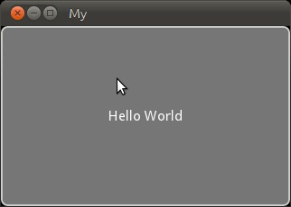

.. _quickstart:

Quickstart
==========

This page explains how to create a simple Kivy *"Hello world"* program.
This assumes you already have Kivy installed. If you do not, head over to the
:ref:`installation` section. We also assume basic `Python <http://docs.python.org/tutorial/>`_
2.x knowledge throughout the rest of this documentation.

Create an application
---------------------

The base code for creating an application looks like this:

.. sourcecode:: python

    import kivy
    kivy.require('1.0.6') # replace with your current kivy version !

    from kivy.app import App
    from kivy.uix.button import Button

    class MyApp(App):
        def build(self):
            return Button(text='Hello World')

    if __name__ in ('__android__', '__main__'):
        MyApp().run()

Save it as `main.py`.

To run the application, follow the instructions for your operating system:

    Linux
        Follow the instructions for :ref:`running Kivy application on Linux <linux-run-app>`::

            $ python main.py

    Windows
        Follow the instructions for :ref:`running Kivy application on Windows <windows-run-app>`::

            $ python main.py
            # or
            C:\appdir>kivy.bat main.py

    Mac OS X
        Follow the instructions for :ref:`running Kivy application on MacOSX <macosx-run-app>`::

            $ kivy main.py

    Android
        Your application needs some complementary files to be able to run on Android.
        See :doc:`android` for further reference.

A window should open, showing a sole button (with the label 'Hello World') that
covers the entire window's area. That's all there is to it.

So what does that code do?

 #. First, we import Kivy, and check if the current installed version will be
    enough for our application. If not, an exception will be automatically
    fired, and prevent your application to crash in runtime. You can read the
    documentation of :func:`kivy.require` function for more information.
 #. We import the :class:`~kivy.app.App` class, to be able to subclass it.
    By subclassing this class, your own class gains several features that
    we already developed for you to make sure it will be recognized by
    Kivy.
 #. Next, we import the :class:`~kivy.uix.button.Button` class, to be able to
    create an instance of a button with a custom label.
 #. Then, we create our application class, based on the App class.
    We extend the :meth:`~kivy.app.App.build` function to be able to return an
    instance of :class:`~kivy.uix.button.Button`. This instance will be used
    as the root of the widget tree (because we returned it).
 #. Finally, we call :meth:`~kivy.app.App.run` on our application instance to
    launch the Kivy process with our application inside.

