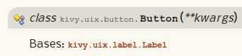

How to read the documentation
=============================

The documentation is seperated in 2 parts:

    - the Programming Guide: it's a must read to understand the Kivy
      basics, specially if you never done GUI programming before.
    - the API: all the functions, classes, methods are explained.

Importing a class
-----------------

The API part is autogenerated from the source code. If you take any class,
it will be generated like this:

It must readed like this: the "Button" class is into the "kivy.uix.button"
module. So if you want to import that class in your code, write that::

    from kivy.uix.button import Button

