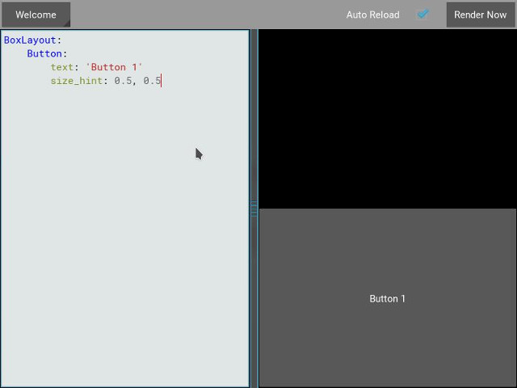
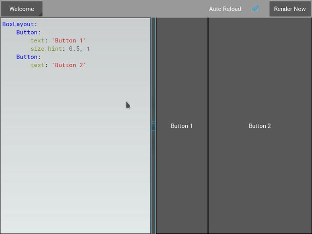
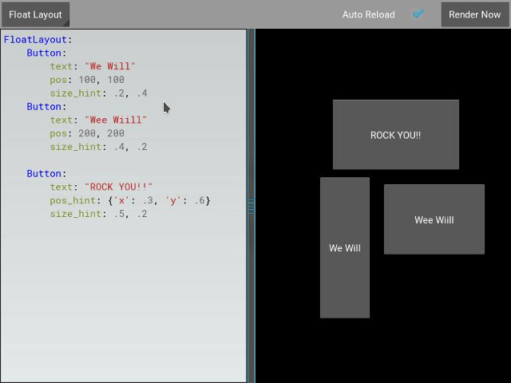

.. _widgets:

Widgets
=======

.. |size_hint| replace:: :attr:`~kivy.uix.widget.Widget.size_hint`
.. |pos_hint| replace:: :attr:`~kivy.uix.widget.Widget.pos_hint`
.. |size_hint_x| replace:: :attr:`~kivy.uix.widget.Widget.size_hint_x`
.. |size_hint_y| replace:: :attr:`~kivy.uix.widget.Widget.size_hint_y`
.. |pos| replace:: :attr:`~kivy.uix.widget.Widget.pos`
.. |size| replace:: :attr:`~kivy.uix.widget.Widget.size`
.. |width| replace:: :attr:`~kivy.uix.widget.Widget.width`
.. |height| replace:: :attr:`~kivy.uix.widget.Widget.height`
.. |children| replace:: :attr:`~kivy.uix.widget.Widget.children`
.. |parent| replace:: :attr:`~kivy.uix.widget.Widget.parent`
.. |x| replace:: :attr:`~kivy.uix.widget.Widget.x`
.. |y| replace:: :attr:`~kivy.uix.widget.Widget.y`
.. |left| replace:: :attr:`~kivy.uix.widget.Widget.left`
.. |right| replace:: :attr:`~kivy.uix.widget.Widget.right`
.. |top| replace:: :attr:`~kivy.uix.widget.Widget.top`
.. |center_x| replace:: :attr:`~kivy.uix.widget.Widget.center_x`
.. |center_y| replace:: :attr:`~kivy.uix.widget.Widget.center_y`
.. |orientation| replace:: :attr:`~kivy.uix.boxlayout.BoxLayout.orientation`
.. |Widget| replace:: :class:`~kivy.uix.widget.Widget`
.. |Button| replace:: :class:`~kivy.uix.button.Button`
.. |Image| replace:: :class:`~kivy.uix.image.Image`
.. |Canvas| replace:: :class:`~kivy.graphics.Canvas`
.. |ListProperty| replace:: :class:`~kivy.properties.ListProperty`
.. |ObjectProperty| replace:: :class:`~kivy.properties.ObjectProperty`
.. |ReferenceListProperty| replace:: :class:`~kivy.properties.ReferenceListProperty`
.. |Layout| replace:: :mod:`~kivy.uix.layout`
.. |RelativeLayout| replace:: :mod:`~kivy.uix.relativelayout`
.. |BoxLayout| replace:: :mod:`~kivy.uix.boxlayout`
.. |FloatLayout| replace:: :mod:`~kivy.uix.floatlayout`
.. |GridLayout| replace:: :mod:`~kivy.uix.gridlayout`
.. |StackLayout| replace:: :mod:`~kivy.uix.stacklayout`
.. |AnchorLayout| replace:: :mod:`~kivy.uix.anchorlayout`
.. |add_widget| replace:: :meth:`~kivy.uix.widget.Widget.add_widget`
.. |remove_widget| replace:: :meth:`~kivy.uix.widget.Widget.remove_widget`

Introduction to Widget
----------------------

A |Widget| is the base building block of GUI interfaces in Kivy.
It provides a |Canvas| that can be used to draw on screen. It receives events
and reacts to them. For a in-depth explanation about the |Widget| class,
look at the module documentation.

Manipulating the Widget tree
----------------------------

Widgets in Kivy are organized in trees. Your
application has a `root widget`, which usually has |children| that can have
|children| of their own. Children of a widget are represented as the |children|
attribute, a Kivy |ListProperty|.

The widget tree can be manipulated with the following methods:

- :meth:`~kivy.uix.widget.Widget.add_widget`: add a widget as a child
- :meth:`~kivy.uix.widget.Widget.remove_widget`: remove a widget from the
  children list
- :meth:`~kivy.uix.widget.Widget.clear_widgets`: remove all children from a
  widget

For example, if you want to add a button inside a BoxLayout, you can do::

    layout = BoxLayout(padding=10)
    button = Button(text='My first button')
    layout.add_widget(button)

The button is added to layout: the button's parent property will be set to layout;
the layout will have the button added to its children list. To remove the button
from the layout::

    layout.remove_widget(button)

With removal, the button's parent property will be set to None, and the layout
will have button removed from its children list.

If you want to clear all the children inside a widget, use
:meth:`~kivy.uix.widget.Widget.clear_widgets` method::

    layout.clear_widgets()

.. warning::

    Never manipulate the children list yourself, unless you really know what you
    are doing. The widget tree is associated with a graphic tree. For example, if you
    add a widget into the children list without adding its canvas to the
    graphics tree, the widget will be a child, yes, but nothing will be drawn
    on the screen. Moreover, you might have issues on further calls of
    add_widget, remove_widget and clear_widgets.

Traversing the Tree
-------------------

The Widget class instance's :attr:`~kivy.uix.widget.Widget.children` list property
contains all the children. You can easily traverse the tree by doing::

    root = BoxLayout()
    # ... add widgets to root ...
    for child in root.children:
        print(child)

However, this must be used carefully. If you intend to modify the children list
with one of the methods shown in the previous section, you must use a copy of
the list like this::

    for child in root.children[:]:
        # manipulate the tree. For example here, remove all widgets that have a
        # width < 100
        if child.width < 100:
            root.remove_widget(child)

Widgets don't influence the size/pos of their children by default. The
|pos| attribute is the absolute position in screen co-ordinates (unless, you
use the |RelativeLayout|. More on that later) and |size|, is an absolute size.

Widgets Z Index
---------------

The order of widget drawing is based on the widget's position in
the widget tree. The :attr:`~kivy.uix.widget.Widget.add_widget`
method takes an `index` parameter which can be used to specify it's position in
the widget tree::

    root.add_widget(widget, index)

The lower indexed widgets will be drawn above those with a higher index. Keep
in mind that the default for `index` is 0, so widgets added later
are drawn on top of the others unless specified otherwise.

Organize with Layouts
---------------------

|Layout| is a special kind of widget that controls the size and position of
its children. There are different kinds of layouts, allowing for different
automatic organization of their children. Layouts use |size_hint| and |pos_hint|
properties to determine the |size| and |pos| of their |children|.

**BoxLayout**:
Arranges widgets in an adjacent manner (either vertically or horizontally) manner,
to fill all the space. The size_hint property of children can be used to change
proportions allowed to each child, or set fixed size for some of them.

.. only:: html

    .. image:: ../images/boxlayout.gif
    .. image:: ../images/gridlayout.gif
    .. image:: ../images/stacklayout.gif
    .. image:: ../images/anchorlayout.gif
    .. image:: ../images/floatlayout.gif

.. only:: latex

    .. image:: ../images/boxlayout.png
    .. image:: ../images/gridlayout.png
    .. image:: ../images/stacklayout.png
    .. image:: ../images/anchorlayout.png
    .. image:: ../images/floatlayout.png

**GridLayout**:
Arranges widgets in a grid. You must specify at least one dimension of the
grid so kivy can compute the size of the elements and how to arrange them.

**StackLayout**:
Arranges widgets adjacent to one another, but with a set size in one of the
dimensions, without trying to make them fit within the entire space. This is
useful to display children of the same predefined size.

**AnchorLayout**:
A simple layout only caring about children positions. It allows putting the
children at a position relative to a border of the layout.
`size_hint` is not honored.

**FloatLayout**:
Allows placing children with arbitrary locations and size, either absolute or
relative to the layout size. Default size_hint (1, 1) will make every child
the same size as the whole layout, so you probably want to change this value
if you have more than one child. You can set size_hint to (None, None) to use
absolute size with `size`. This widget honors `pos_hint` also, which as a dict
setting position relative to layout position.

**RelativeLayout**:
Behaves just like FloatLayout, except children positions are relative to layout
position, not the screen.

Examine the documentation of the individual layouts for a more in-depth
understanding.

|size_hint| and |pos_hint|:

- |FloatLayout|
- |BoxLayout|
- |GridLayout|
- |StackLayout|
- |RelativeLayout|
- |AnchorLayout|

|size_hint| is a |ReferenceListProperty| of
|size_hint_x| and |size_hint_y|. It accepts values from `0` to `1` or `None`
and defaults to `(1, 1)`. This signifies that if the widget is in a layout,
the layout will allocate it as much place as possible in both directions
(relative to the layouts size).

Setting |size_hint| to (0.5, 0.8), for example, will make the widget 50% the
width and 80% the height of available size for the |widget| inside a |layout|.

Consider the following example:

.. code-block:: kv

    BoxLayout:
        Button:
            text: 'Button 1'
            # default size_hint is 1, 1, we don't need to specify it explicitly
            # however it's provided here to make things clear
            size_hint: 1, 1

load kivy catalog::

    cd $KIVYDIR/examples/demo/kivycatalog
    python main.py

Replace $KIVYDIR with the directory of your installation of Kivy. Click on the
button labeled `Box Layout` from the left. Now paste the code from above into
the editor panel on the right.

.. image:: images/size_hint[B].jpg

As you can see from the image above, the `Button` takes up 100% of the layout
|size|.

Changing the |size_hint_x|/|size_hint_y| to .5 will make the |widget| take 50%
of the |layout| |width|/|height|.

You can see here that, although we specify |size_hint_x| and |size_hint_y| both
to be .5, only |size_hint_x| seems to be honored. That is because |BoxLayout|
controls the |size_hint_y| when |orientation| is `vertical` and |size_hint_x|
when |orientation| is 'horizontal'. The controlled dimension's size is calculated depending
upon the total no. of |children| in the |BoxLayout|. In this example, one child has
|size_hint_y| controlled (.5/.5 = 1). Thus, the widget takes 100% of the parent
layout's height.

Let's add another |Button| to the |layout| and see what happens.

.. image:: images/size_hint[bb].jpg

|BoxLayout| by its very nature divides the available space between its
|children| equally. In our example, the proportion is 50-50, because we have two
|children|. Let's use size_hint on one of the children and see the results.

If a child specifies |size_hint|, this specifies how much space the |Widget|
will take out of the |size| given to it by the |BoxLayout|. In our example, the
first |Button| specifies .5 for |size_hint_x|. The space for the widget is
calculated like so::

    first child's size_hint divided by
    first child's size_hint + second child's size_hint + ...n(no of children)
    
    .5/(.5+1) = .333...

The rest of the BoxLayout's |width| is divided among the rest of the |children|.
In our example, this means the second |Button| takes up 66.66% of the |layout|
|width|.

Experiment with |size_hint| to get comfortable with it.

If you want to control the absolute |size| of a |Widget|, you can set
|size_hint_x|/|size_hint_y| or both to `None` so that the widget's |width| and or
|height| attributes will be honored.

|pos_hint| is a dict, which defaults to empty. As for |size_hint|, layouts honor
|pos_hint| differently, but generally you can add values to any of the |pos|
attributes (|x|, |y|, |right|, |top|, |center_x|, |center_y|) to have the
|Widget| positioned relative to its |parent|.

Let's experiment with the following code in kivycatalog to understand |pos_hint|
visually:

.. code-block:: kv

    FloatLayout:
        Button:
            text: "We Will"
            pos: 100, 100
            size_hint: .2, .4
        Button:
            text: "Wee Wiill"
            pos: 200, 200
            size_hint: .4, .2

        Button:
            text: "ROCK YOU!!"
            pos_hint: {'x': .3, 'y': .6}
            size_hint: .5, .2

This gives us:

As with |size_hint|, you should experiment with |pos_hint| to
understand the effect it has on the widget positions.

.. _adding_widget_background:

Adding a Background to a Layout
-------------------------------

One of the frequently asked questions about layouts is:::

    "How to add a background image/color/video/... to a Layout"

Layouts by their nature have no visual representation: they have no canvas
instructions by default. However you can add canvas instructions to a layout
instance easily, as with adding a colored background:

In Python::

    from kivy.graphics import Color, Rectangle

    with layout_instance.canvas.before:
        Color(0, 1, 0, 1) # green; colors range from 0-1 instead of 0-255
        self.rect = Rectangle(size=layout_instance.size,
                               pos=layout_instance.pos)

Unfortunately, this will only draw a rectangle at the layout's initial position
and size. To make sure the rect is drawn inside the layout, when the layout
size/pos changes, we need to listen to any changes and update the rectangles
size and pos. We can do that as follows::

    with layout_instance.canvas.before:
        Color(0, 1, 0, 1) # green; colors range from 0-1 instead of 0-255
        self.rect = Rectangle(size=layout_instance.size,
                               pos=layout_instance.pos)

    def update_rect(instance, value):
        instance.rect.pos = instance.pos
        instance.rect.size = instance.size

    # listen to size and position changes
    layout_instance.bind(pos=update_rect, size=update_rect)

In kv:

.. code-block:: kv

    FloatLayout:
        canvas.before:
            Color:
                rgba: 0, 1, 0, 1
            Rectangle:
                # self here refers to the widget i.e BoxLayout
                pos: self.pos
                size: self.size

The kv declaration sets an implicit binding: the last two kv lines ensure that
the |pos| and |size| values of the rectangle will update when the |pos| of the
|FloatLayout| changes.

Now we put the snippets above into the shell of Kivy App.

Pure Python way::

    from kivy.app import App
    from kivy.graphics import Color, Rectangle
    from kivy.uix.floatlayout import FloatLayout
    from kivy.uix.button import Button
    
    
    class RootWidget(FloatLayout):
    
        def __init__(self, **kwargs):
            # make sure we aren't overriding any important functionality
            super(RootWidget, self).__init__(**kwargs)
    
            # let's add a Widget to this layout
            self.add_widget(
                Button(
                    text="Hello World",
                    size_hint=(.5, .5),
                    pos_hint={'center_x': .5, 'center_y': .5}))
    
    
    class MainApp(App):
    
        def build(self):
            self.root = root = RootWidget()
            root.bind(size=self._update_rect, pos=self._update_rect)

            with root.canvas.before:
                Color(0, 1, 0, 1)  # green; colors range from 0-1 not 0-255
                self.rect = Rectangle(size=root.size, pos=root.pos)
            return root
    
        def _update_rect(self, instance, value):
            self.rect.pos = instance.pos
            self.rect.size = instance.size
    
    if __name__ == '__main__':
        MainApp().run()

Using the kv Language::

    from kivy.app import App
    from kivy.lang import Builder

    root = Builder.load_string('''
    FloatLayout:
        canvas.before:
            Color:
                rgba: 0, 1, 0, 1
            Rectangle:
                # self here refers to the widget i.e FloatLayout
                pos: self.pos
                size: self.size
        Button:
            text: 'Hello World!!'
            size_hint: .5, .5
            pos_hint: {'center_x':.5, 'center_y': .5}
    ''')

    class MainApp(App):

        def build(self):
            return root

    if __name__ == '__main__':
        MainApp().run()

Both of the Apps should look something like this:

.. image:: images/layout_background.png

Add a color to the background of a **custom layouts rule/class**
~~~~~~~~~~~~~~~~~~~~~~~~~~~~~~~~~~~~~~~~~~~~~~~~~~~~~~~~~~~~~~~~

The way we add background to the layout's instance can quickly become
cumbersome if we need to use multiple layouts. To help with this, you can
subclass the Layout and create your own layout that adds a background.

Using Python::

    from kivy.app import App
    from kivy.graphics import Color, Rectangle
    from kivy.uix.boxlayout import BoxLayout
    from kivy.uix.floatlayout import FloatLayout
    from kivy.uix.image import AsyncImage
    
    
    class RootWidget(BoxLayout):
        pass
    
    
    class CustomLayout(FloatLayout):
    
        def __init__(self, **kwargs):
            # make sure we aren't overriding any important functionality
            super(CustomLayout, self).__init__(**kwargs)
    
            with self.canvas.before:
                Color(0, 1, 0, 1)  # green; colors range from 0-1 instead of 0-255
                self.rect = Rectangle(size=self.size, pos=self.pos)
    
            self.bind(size=self._update_rect, pos=self._update_rect)
    
        def _update_rect(self, instance, value):
            self.rect.pos = instance.pos
            self.rect.size = instance.size
    
    
    class MainApp(App):
    
        def build(self):
            root = RootWidget()
            c = CustomLayout()
            root.add_widget(c)
            c.add_widget(
                AsyncImage(
                    source="http://www.everythingzoomer.com/wp-content/uploads/2013/01/Monday-joke-289x277.jpg",
                    size_hint= (1, .5),
                    pos_hint={'center_x':.5, 'center_y':.5}))
            root.add_widget(AsyncImage(source='http://www.stuffistumbledupon.com/wp-content/uploads/2012/05/Have-you-seen-this-dog-because-its-awesome-meme-puppy-doggy.jpg'))
            c = CustomLayout()
            c.add_widget(
                AsyncImage(
                    source="http://www.stuffistumbledupon.com/wp-content/uploads/2012/04/Get-a-Girlfriend-Meme-empty-wallet.jpg",
                    size_hint= (1, .5),
                    pos_hint={'center_x':.5, 'center_y':.5}))
            root.add_widget(c)
            return root
    
    if __name__ == '__main__':
        MainApp().run()

Using the kv Language::

    from kivy.app import App
    from kivy.uix.floatlayout import FloatLayout
    from kivy.uix.boxlayout import BoxLayout
    from kivy.lang import Builder

    Builder.load_string('''
    <CustomLayout>
        canvas.before:
            Color:
                rgba: 0, 1, 0, 1
            Rectangle:
                pos: self.pos
                size: self.size

    <RootWidget>
        CustomLayout:
            AsyncImage:
                source: 'http://www.everythingzoomer.com/wp-content/uploads/2013/01/Monday-joke-289x277.jpg'
                size_hint: 1, .5
                pos_hint: {'center_x':.5, 'center_y': .5}
        AsyncImage:
            source: 'http://www.stuffistumbledupon.com/wp-content/uploads/2012/05/Have-you-seen-this-dog-because-its-awesome-meme-puppy-doggy.jpg'
        CustomLayout
            AsyncImage:
                source: 'http://www.stuffistumbledupon.com/wp-content/uploads/2012/04/Get-a-Girlfriend-Meme-empty-wallet.jpg'
                size_hint: 1, .5
                pos_hint: {'center_x':.5, 'center_y': .5}
    ''')

    class RootWidget(BoxLayout):
        pass

    class CustomLayout(FloatLayout):
        pass

    class MainApp(App):

        def build(self):
            return RootWidget()

    if __name__ == '__main__':
        MainApp().run()

Both of the Apps should look something like this:

Defining the background in the custom layout class, assures that it will be used 
in every instance of CustomLayout.

Now, to add an image or color to the background of a built-in Kivy layout,
**globally**, we need to override the kv rule for the layout in question.
Consider GridLayout::

    <GridLayout>
        canvas.before:
            Color:
                rgba: 0, 1, 0, 1
            BorderImage:
                source: '../examples/widgets/sequenced_images/data/images/button_white.png'
                pos: self.pos
                size: self.size

Then, when we put this snippet into a Kivy app::

    from kivy.app import App
    from kivy.uix.floatlayout import FloatLayout
    from kivy.lang import Builder

    Builder.load_string('''
    <GridLayout>
        canvas.before:
            BorderImage:
                # BorderImage behaves like the CSS BorderImage
                border: 10, 10, 10, 10
                source: '../examples/widgets/sequenced_images/data/images/button_white.png'
                pos: self.pos
                size: self.size

    <RootWidget>
        GridLayout:
            size_hint: .9, .9
            pos_hint: {'center_x': .5, 'center_y': .5}
            rows:1
            Label:
                text: "I don't suffer from insanity, I enjoy every minute of it"
                text_size: self.width-20, self.height-20
                valign: 'top'
            Label:
                text: "When I was born I was so surprised; I didn't speak for a year and a half."
                text_size: self.width-20, self.height-20
                valign: 'middle'
                halign: 'center'
            Label:
                text: "A consultant is someone who takes a subject you understand and makes it sound confusing"
                text_size: self.width-20, self.height-20
                valign: 'bottom'
                halign: 'justify'
    ''')

    class RootWidget(FloatLayout):
        pass

    class MainApp(App):

        def build(self):
            return RootWidget()

    if __name__ == '__main__':
        MainApp().run()

The result should look something like this:

As we are overriding the rule of the class GridLayout, any use of this
class in our app will display that image.

How about an **Animated background**?

You can set the drawing instructions like Rectangle/BorderImage/Ellipse/... to
use a particular texture::

    Rectangle:
        texture: reference to a texture

We use this to display an animated background::

    from kivy.app import App
    from kivy.uix.floatlayout import FloatLayout
    from kivy.uix.gridlayout import GridLayout
    from kivy.uix.image import Image
    from kivy.properties import ObjectProperty
    from kivy.lang import Builder

    Builder.load_string('''
    <CustomLayout>
        canvas.before:
            BorderImage:
                # BorderImage behaves like the CSS BorderImage
                border: 10, 10, 10, 10
                texture: self.background_image.texture
                pos: self.pos
                size: self.size

    <RootWidget>
        CustomLayout:
            size_hint: .9, .9
            pos_hint: {'center_x': .5, 'center_y': .5}
            rows:1
            Label:
                text: "I don't suffer from insanity, I enjoy every minute of it"
                text_size: self.width-20, self.height-20
                valign: 'top'
            Label:
                text: "When I was born I was so surprised; I didn't speak for a year and a half."
                text_size: self.width-20, self.height-20
                valign: 'middle'
                halign: 'center'
            Label:
                text: "A consultant is someone who takes a subject you understand and makes it sound confusing"
                text_size: self.width-20, self.height-20
                valign: 'bottom'
                halign: 'justify'
    ''')

    class CustomLayout(GridLayout):

        background_image = ObjectProperty(
            Image(
                source='../examples/widgets/sequenced_images/data/images/button_white_animated.zip',
                anim_delay=.1))

    class RootWidget(FloatLayout):
        pass

    class MainApp(App):

        def build(self):
            return RootWidget()

    if __name__ == '__main__':
        MainApp().run()

To try to understand what is happening here, start from line 13::

    texture: self.background_image.texture

This specifies that the `texture` property of `BorderImage` will be updated
whenever the `texture` property of `background_image` updates. We define the
background_image property at line 40::

    background_image = ObjectProperty(...

This sets up `background_image` as an |ObjectProperty| in which we add an |Image|
widget. An image widget has a `texture` property; where you see
`self.background_image.texture`, this sets a reference, `texture`, to this property.
The |Image| widget supports animation: the texture of the image is updated whenever
the animation changes, and the texture of BorderImage instruction is updated in
the process.

You can also just blit custom data to the texture. For details, look at the
documentation of :class:`~kivy.graphics.texture.Texture`.

Nesting Layouts
---------------

Yes! It is quite fun to see how extensible the process can be.

Size and position metrics
-------------------------

.. |Transitions| replace:: :class:`~kivy.uix.screenmanager.TransitionBase`
.. |ScreenManager| replace:: :class:`~kivy.uix.screenmanager.ScreenManager`
.. |Screen| replace:: :class:`~kivy.uix.screenmanager.Screen`
.. |screen| replace:: :mod:`~kivy.modules.screen`
.. |metrics| replace:: :mod:`~kivy.metrics`
.. |pt| replace:: :attr:`~kivy.metrics.pt`
.. |mm| replace:: :attr:`~kivy.metrics.mm`
.. |cm| replace:: :attr:`~kivy.metrics.cm`
.. |in| replace:: :attr:`~kivy.metrics.inch`
.. |dp| replace:: :attr:`~kivy.metrics.dp`
.. |sp| replace:: :attr:`~kivy.metrics.sp`

Kivy's default unit for length is the pixel, all sizes and positions are
expressed in it by default. You can express them in other units, which is
useful to achieve better consistency across devices (they get converted to the
size in pixels automatically).

Available units are |pt|, |mm|, |cm|, |in|, |dp| and |sp|. You can learn about
their usage in the |metrics| documentation.

You can also experiment with the |screen| usage to simulate various devices
screens for your application.

Screen Separation with Screen Manager
-------------------------------------

If your application is composed of various screens, you likely want an easy
way to navigate from one |Screen| to another. Fortunately, there is the
|ScreenManager| class, that allows you to define screens separately, and to set
the |Transitions| from one to another.
