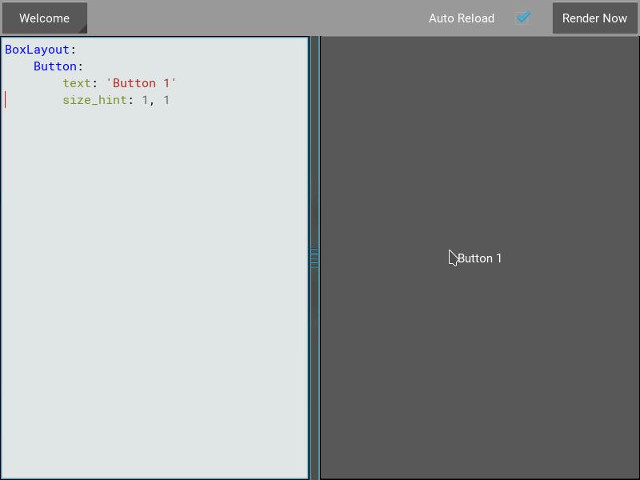
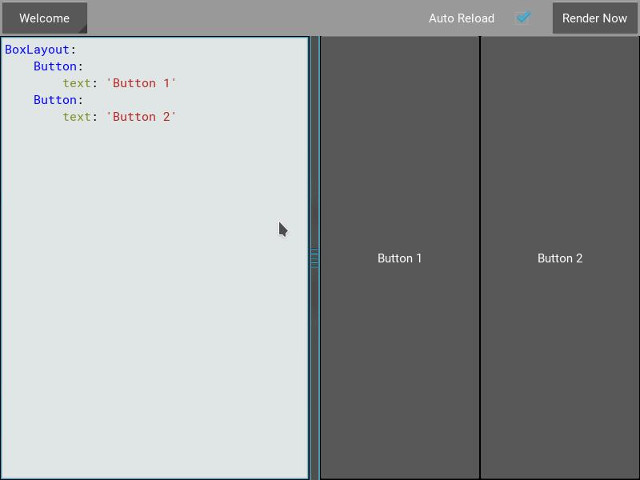

.. _widgets:

Widgets
=======

.. |size_hint| replace:: :attr:`~kivy.uix.widget.Widget.size_hint`
.. |pos_hint| replace:: :attr:`~kivy.uix.widget.Widget.pos_hint`
.. |size_hint_x| replace:: :attr:`~kivy.uix.widget.Widget.size_hint_x`
.. |size_hint_y| replace:: :attr:`~kivy.uix.widget.Widget.size_hint_y`
.. |pos| replace:: :attr:`~kivy.uix.widget.Widget.pos`
.. |size| replace:: :attr:`~kivy.uix.widget.Widget.size`
.. |width| replace:: :attr:`~kivy.uix.widget.Widget.width`
.. |height| replace:: :attr:`~kivy.uix.widget.Widget.height`
.. |children| replace:: :attr:`~kivy.uix.widget.Widget.children`
.. |parent| replace:: :attr:`~kivy.uix.widget.Widget.parent`
.. |x| replace:: :attr:`~kivy.uix.widget.Widget.x`
.. |y| replace:: :attr:`~kivy.uix.widget.Widget.y`
.. |left| replace:: :attr:`~kivy.uix.widget.Widget.left`
.. |top| replace:: :attr:`~kivy.uix.widget.Widget.top`
.. |center_x| replace:: :attr:`~kivy.uix.widget.Widget.center_x`
.. |center_y| replace:: :attr:`~kivy.uix.widget.Widget.center_y`
.. |orientation| replace:: :attr:`~kivy.uix.boxlayout.BoxLayout.orientation`
.. |Widget| replace:: :class:`~kivy.uix.widget.Widget`
.. |Button| replace:: :class:`~kivy.uix.button.Button`
.. |Canvas| replace:: :class:`~kivy.graphics.Canvas`
.. |ListProperty| replace:: :class:`~kivy.properties.ListProperty`
.. |ReferenceListProperty| replace:: :class:`~kivy.properties.ReferenceListProperty`
.. |Layout| replace:: :mod:`~kivy.uix.layout`
.. |RelativeLayout| replace:: :mod:`~kivy.uix.relativelayout`
.. |BoxLayout| replace:: :mod:`~kivy.uix.boxlayout`
.. |FloatLayout| replace:: :mod:`~kivy.uix.floatlayout`
.. |GridLayout| replace:: :mod:`~kivy.uix.gridlayout`
.. |StackLayout| replace:: :mod:`~kivy.uix.stacklayout`
.. |AnchorLayout| replace:: :mod:`~kivy.uix.anchorlayout`
.. |add_widget| replace:: :meth:`~kivy.uix.widget.Widget.add_widget`
.. |remove_widget| replace:: :meth:`~kivy.uix.widget.Widget.remove_widget`

Introduction to Widgets
-----------------------

A |Widget| can be seen as the base building block for GUI interfaces in Kivy.
It provides a |Canvas| that can be used to draw on screen. It receives events
and reacts to them. For a in depth explanation of the |Widget| class,
please consult the documentation.

Manipulating the Widget tree
----------------------------

Widgets in kivy, like in many other frameworks, are organized in Trees. Your
Window has a `root widget` which usually has |children|, each of which can have
|children| of their own. Children of a widget are listed in the |children|
attribute which is a |ListProperty|.

The Widget Tree can be manipulated with the following methods:

- :meth:`~kivy.uix.widget.Widget.add_widget`: add a widget as a child
- :meth:`~kivy.uix.widget.Widget.remove_widget`: remove a widget from the
  list of children
- :meth:`~kivy.uix.widget.Widget.clear_widgets`: remove all children from a
  widget

For example, if you want to add a button inside a boxlayout, you can do::

    layout = BoxLayout(padding=10)
    button = Button(text='My first button')
    layout.add_widget(button)

Now, the `button.parent` property will be set to `layout`, and `layout` will
have the button in its list of `children`. To remove the button from the layout::

    layout.remove_widget(button)

The `button.parent` will be set to `None`, and `layout` will remove the
button from it's list of `children`.

If you want to remove all the children inside a widget, use the
:meth:`~kivy.uix.widget.Widget.clear_widgets` method::
 
    layout.clear_widgets()

.. warning::

    Never manipulate the `children` list directly unless you know what you are
    doing. The widget tree is associated to a graphics tree. If you
    add a widget into the `children` list without adding its canvas to the
    graphics tree, the widget will be a child but nothing will be drawn
    on the screen. Furthermore, you might have issues with later calls to
    `add_widget`, `remove_widget` and `clear_widgets`.

Traversing the tree
-------------------

The widget class has a :data:`~kivy.uix.widget.Widget.children` list property
that contains all the children. You can easily traverse the tree by doing::

    root = BoxLayout()
    # ... add widgets to root ...
    for child in root.children:
        print child

However, this must be used carefully. If you intend to modify the `children` list
with one of the methods shown in the previous section, you must use a copy of
the list like this::

    for child in root.children[:]:
        # manipulate the tree. For example here, remove all widgets that have a
        # width < 100
        if child.width < 100:
            root.remove_widget(child)

Widgets don't influence the size/pos of their children by default, so the
|pos| attribute is the absolute position in screen co-ordinates and |size| is its
absolute size. The only exception to this is when you use the |RelativeLayout|, 
but we'll get back to that later.

Widgets Z index
---------------
A widgets canvas/graphical representation is drawn based on its position in
the Widget Tree i.e. The last widgets canvas is drawn last (on top of everything
else inside its parent). The `add_widget` method takes a `index` parameter that
you can use like so::

    root.add_widget(widget, index)

Using the index parameter, you can specify the childs place in the widget tree and
thus its z-index.

Organize with Layouts
---------------------

A |Layout| is a special kind of widget that controls the size and position of
its children. There are different kinds of layouts which automatically position
their children if various ways. Layouts use |size_hint| and |pos_hint|
properties to determine the |size| and |pos| of their |children|.

**BoxLayout**:
Arranges widgets in a left-to-right (if its orientation property is `horizontal`) 
or top-to-bottom (if its orientation property is `vertical`) manner,
using all the space available.
The `size_hint` of its children can be used to change the proportions of each
child or set fixed sizes for them.

.. only:: html

    .. image:: ../images/boxlayout.gif
        :align: left
    .. image:: ../images/gridlayout.gif
        :align: right
    .. image:: ../images/stacklayout.gif
        :align: left
    .. image:: ../images/anchorlayout.gif
        :align: right
    .. image:: ../images/floatlayout.gif

.. only:: latex

    .. image:: ../images/boxlayout.png
    .. image:: ../images/gridlayout.png
    .. image:: ../images/stacklayout.png
    .. image:: ../images/anchorlayout.png
    .. image:: ../images/floatlayout.png

**GridLayout**:
Arranges widgets in a grid. You must specifiy at least one dimension for the
grid so that kivy can compute the size of the elements and determine how to
arrange them.

**StackLayout**:
Arranges widgets side-by-side (or top-to-bottom, again depending on the orientation
property), but with a given size i.e. it does not stretch them fit the
available space. This is useful when you have a set of children of some
predefined size.

**AnchorLayout**:
A simple layout that only cares about its childrens position relative to its borders.
Children are "attached" to the bounding rectangle of the layout via the `anchor_x`
and `anchor_y` properties.

`pos_hint` is not honored.

**FloatLayout**:
Allows for the placement of children in arbitrary places and with arbitrary sizes,
either absolute or relative to the layout. The default `size_hint` (1, 1)
will make all the children the same size as the layout, so you will probably
want to change this value if you have more than one child. You can set the
`size_hint` to (None, None) to keep the childs predefined `size`.

This widget honors `pos_hint`, which is a dict
allowing to you to set the widgits position relative to the layouts position.

**RelativeLayout**:
Similar to the FloatLayout, except the childrens positions are relative to
layouts position, not the screen.

Look at the documentation of the various Layouts to get a in-depth
understanding of how they work with |size_hint| and |pos_hint|:

- |FloatLayout|
- |BoxLayout|
- |GridLayout|
- |StackLayout|
- |RelativeLayout|
- |AnchorLayout|

|size_hint| is a |ReferenceListProperty| of
|size_hint_x| and |size_hint_y|. It accepts values from `0` to `1` or `None`
and defaults to `(1, 1)`. This signifies that if the widget is in a layout,
the layout will allocate it as much space as possible in both directions
(relative to the layouts size).

Setting |size_hint| to `(0.5, 0.8)` for example, will make the widget 50% of the
width and 80% of the height of the available space for the |widget| inside the |layout|.

Consider the following example:

.. code-block:: kv

    BoxLayout:
        Button:
            text: 'Button 1'
            # default size_hint is 1, 1, we don't need to specify it explicitly
            # however it's provided here to make things clear
            size_hint: 1, 1

In order to see it, load kivy catalog::

    cd $KIVYDIR/examples/demo/kivycatalog
    python main.py

Replace $KIVYDIR with the directory of your installation of Kivy. Click on the
button labeled `Box Layout` on the left. Now paste the code above into
the Editor on the right.

As you can see from the image above, the `Button` takes up 100% of the layouts
|size|.

Changing the |size_hint_x|/|size_hint_y| to `.5` will make the |widget| take 50%
of the |layout| |width|/|height|.

.. image:: images/size_hint[b_].jpg

You can see here that although we specify |size_hint_x| and |size_hint_y| both
to be `.5`, only |size_hint_x| seems to be honored. That's because the |BoxLayout|
controls the |size_hint_y| when |orientation| is `vertical` and |size_hint_x|
when |orientation| is 'horizontal'. That means the controlled side's size is
calculated depending upon the total number of |children| in the |BoxLayout|. Here,
that's one child with |size_hint_y| controlled, so .5/.5 = 1. Thus the widget
takes 100% of the parent layout's height.

Let's add another |Button| to the |layout| and see what happens.

The |BoxLayout|, by its very nature, divides the available space between its
|children| equally. In our case, that's 50-50 as we have two |children|. Let's
use `size_hint` on one of the children and look at the results.

.. image:: images/size_hint[oB].jpg

If a child specifies |size_hint|, that specifies how much space the |Widget|
will take out of the |size| allotted to it by the |BoxLayout|. In our case the
first |Button| specifies `.5` for |size_hint_x|. The space for the widget is
calculated as follows::

    first child's size_hint divided by
    first child's size_hint + second child's size_hint + ...n(no of children)
    
    .5/(.5+1) = .333...

The rest of the BoxLayouts |width| is divided amongst the rest of the |children|.
In our case, that means the second |Button| takes up 66.66% of the |layout|
|width|.

Go ahead and experiment with |size_hint| to get comfortable with it.

If you want to control the absolute |size| of a |Widget|, you can set
|size_hint_x|/|size_hint_y| or both to `None` so that the widgets |width| and/or
|height| attributes will be honored.

|pos_hint| is a dict which defaults to empty. Different
layouts honor |size_hint| differently, but you can add values to any of the |pos|
attributes (|x|, |y|, |left|, |top|, |center_x|, |center_y|) to have the
|Widget| positioned relatively to its |parent|.

Lets experiment with the following code in kivycatalog to understand |pos_hint|
visually:

.. code-block:: kv

    FloatLayout:
        Button:
            text: "We Will"
            pos: 100, 100
            size_hint: .2, .4
        Button:
            text: "Wee Wiill"
            pos: 200, 200
            size_hint: .4, .2

        Button:
            text: "ROCK YOU!!"
            pos_hint: {'x': .3, 'y': .6}
            size_hint: .5, .2

This code should give us something that looks like this:

.. image:: images/pos_hint.jpg

You can experiment further with |pos_hint| by changing the values to
understand the effect they have on the widgets position.

Adding a Background to a Layout
-------------------------------

One of the frequently asked questions about layouts is:

    "How to add a background image/color/video/... to a Layout"

Layouts by their nature have no visual representation, i.e. they have no canvas
instructions by default. You can however, add instructions to the layouts canvas.

To add a color to the background of a **layout**

In Python::

    with layout_instance.canvas.before:
        Color(rgba(0, 1, 0, 1)) # green; colors range from 0-1 instead of 0-255
        self.rect = Rectangle(
                                size=layout_instance.size,
                                pos=layout_instance.pos)

Unfortunately this will only draw a rectangle at the layouts initial position
and size. To make sure the rect is drawn inside the layout if the layout size/pos
changes, we need to listen for any changes and update the Rectangles size and pos
accordingly::

    # listen to size and position changes
    layout_instance.bind(
                        size=self._update_rect,
                        pos=self._update_rect)
    
    ...
    def _update_rect(self, instance, value):
        self.rect.pos = instance.pos
        self.rect.size = instance.size

In kv:

.. code-block:: kv

    ...
    ...
    FloatLayout:
        canvas.before:
            Color:
                rgba: 0, 1, 0, 1
            Rectangle:
                # self here refers to the widget i.e BoxLayout
                pos: self.pos
                size: self.size

This example also demonstrates the advantage of using kv files: the binding is implicit.
The kv language in the last two lines updates the
rectangles |pos| and |size| when the |pos| of the |FloatLayout|
changes. QED.

Now let's put the snippets above into the shell of a Kivy App.
Pure Python way::

    from kivy.app import App
    from kivy.graphics import Color, Rectangle
    from kivy.uix.floatlayout import FloatLayout
    from kivy.uix.button import Button

    class RootWidget(FloatLayout):

        def __init__(self, **kwargs):
            # make sure we aren't overriding any important functionality
            super(RootWidget, self).__init__(**kwargs)

            with self.canvas.before:
                Color(0, 1, 0, 1) # green; colors range from 0-1 instead of 0-255
                self.rect = Rectangle(
                                size=self.size,
                                pos=self.pos)

            # let's add a Widgetto this layout
            self.add_widget(
                            Button( text="Hello World",
                                    size_hint= (.5, .5),
                                    pos_hint={'center_x':.5,
                                            'center_y':.5}))

            self.bind(
                        size=self._update_rect,
                        pos=self._update_rect)

        def _update_rect(self, instance, value):
            self.rect.pos = instance.pos
            self.rect.size = instance.size

    class MainApp(App):

        def build(self):
            return RootWidget()

    if __name__ == '__main__':
        MainApp().run()

Using the kv language::

    from kivy.app import App
    from kivy.uix.floatlayout import FloatLayout
    from kivy.lang import Builder

    Builder.load_string('''
    <RootWidget>
        canvas.before:
            Color:
                rgba: 0, 1, 0, 1
            Rectangle:
                # self here refers to the widget i.e BoxLayout
                pos: self.pos
                size: self.size
        Button:
            text: 'Hello World!!'
            size_hint: .5, .5
            pos_hint: {'center_x':.5, 'center_y': .5}
    ''')

    class RootWidget(FloatLayout):
        pass

    class MainApp(App):

        def build(self):
            return RootWidget()

    if __name__ == '__main__':
        MainApp().run()

Isn't this a lot simpler?

Both of the Apps should look something like this:

.. image:: images/layout_background.png

To add a color to the background of a **custom layouts rule/class**

To add a color to the background of a **layout globally**

Now Let's have some fun and add a **Image to the background**

A Few Advanced Topics::

    How about a **Animated background**?

    Blitt custom data to the background

Nesting Layouts
---------------

Yes! Not only can you nest layouts, it is actually quite fun to see how extensible nesting layouts can be.

Size and position metrics
-------------------------

.. |Transitions| replace:: :class:`~kivy.uix.screenmanager.TransitionBase`
.. |ScreenManager| replace:: :class:`~kivy.uix.screenmanager.ScreenManager`
.. |Screen| replace:: :class:`~kivy.uix.screenmanager.Screen`
.. |screen| replace:: :mod:`~kivy.modules.screen`
.. |metrics| replace:: :mod:`~kivy.metrics`
.. |pt| replace:: :attr:`~kivy.metrics.pt`
.. |mm| replace:: :attr:`~kivy.metrics.mm`
.. |cm| replace:: :attr:`~kivy.metrics.cm`
.. |in| replace:: :attr:`~kivy.metrics.in`
.. |dp| replace:: :attr:`~kivy.metrics.dp`
.. |sp| replace:: :attr:`~kivy.metrics.sp`

Kivys default unit for length is the pixel: all sizes and positions are
expressed in pixels by default. You can express them in other units, which is
useful to achieve better consistency across devices (they get converted to the
size in pixels automatically).

All available units are |pt|, |mm|, |cm|, |in|, |dp| and |sp|. You can read more
about their usage in the |metrics| documentation.

On a related note, you can read the |screen| documentation to see how to simulate
various devices and screen sizes for your application.

Screen Separation with Screen Manager
-------------------------------------

If your application is composed of multiple screens, you will most likely want an easy
way to navigate from one |Screen| to another. Fortunately, there is
|ScreenManager| class that allows you to define screens separately, and to set
the |Transitions| from one to the other.
