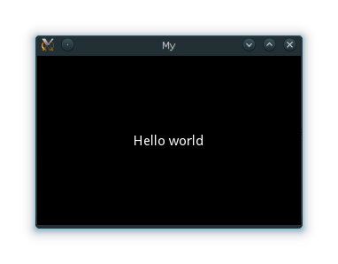

.. _basic:

Kivy Basics
===========

Installation of Kivy environment
--------------------------------

Kivy depends on multiples dependencies, such as pygame, gstreamer, PIL,
Cairo, and more. All of them are not required, but depending on the
platform you're working on, it can be a pain to install them. For
Windows and MacOS X, we provide a portable package that you can just
unzip and use.

.. toctree::
    :maxdepth: 1

    /installation/installation-windows.rst
    /installation/installation-macosx.rst
    /installation/installation-linux.rst

If you want to install everything yourself, ensure that you have at
least `Cython <http://cython.org>`_, `Pygame <http://pygame.org>`. A
typical pip
installation look like::

    pip install cython
    pip install hg+http://bitbucket.org/pygame/pygame
    pip install kivy

The `development version <https://github.com/kivy/kivy>`_ can be
installed with git::

    git clone https://github.com/kivy/kivy
    make

Create an application
---------------------

Creating a kivy application is as simple as:

- sub-classing the :class:`~kivy.app.App` class
- implementing its :meth:`~kivy.app.App.build` method so it returns a
  :class:`~kivy.uix.Widget` instance (the root of your widget tree) -
  instantiating this class, and call its :meth:`~kivy.app.App.run`
  method.

Here is an example of such a minimal application::

    from kivy.app import App
    from kivy.uix.label import Label
    
    
    class MyApp(App):
    
        def build(self):
            return Label(text='Hello world')
    
    
    if __name__ == '__main__':
        MyApp().run()

You can save this to a text file, `main.py` for example, and run it.

Explanation of what's going on in the code above
------------------------------------------------

First off, Let us get familiar with the Kivy app life cycle

.. image:: ../images/Kivy_App_Life_Cycle.png

As you can see above for all intents and purposes our entry point in to our App
is from run() in our case that is MyApp().run(). We will get back to this; first
let's start from the first line::

    from kivy.app import App

It's required that the base Class of your App inherit from App class. It's 
present in the kivy_installation_dir/kivy/app.py.

.. Note::
    Go ahead and Open up that file if you want to delve deeper into what Kivy
    App class does. We encourage you to open the code and read through as kivy
    is based on Python and uses Sphinx for documentation, documentation for each
    class is in-file.

Similarly on line 2::

    from kivy.uix.label import Label

One important thing to note here is the way packages/classes are laid out in
kivy, `kivy.uix`; is the section that holds its User Interface elements like 
layouts and  widgets.

Moving on to line 5::

    class MyApp(App):

This is where we are `defining` the Base Class of our Kivy App. You should only
ever need to change the name of your app `MyApp` in this line.

Further on to line 7::

    def build(self):

As highlighted by the image above show casing `Kivy App Life Cycle` This is the
function where you should initialize and return your `Root Widget`,This is what
we do on line 8.::

    return Label(text='Hello world')

Here we initialize a Label with text 'Hello World' and return it's instance.
This Label will be the Root Widget of this App.

.. Note::
    Python uses indentation to denote code blocks, therefore make note that in
    the code provided above, at line 9 the class and function definition ends.

Now on to the portion that will make our app run at line 11 and 12::

    if __name__ == '__main__':
        MyApp().run()

Here the class `MyApp` is initialized and it's run() method called this
initializes and starts our Kivy application.

Running the application
-----------------------
To run the application, follow the instructions for your operating system:

    Linux
        Follow the instructions for
        :ref:`running Kivy application on Linux <linux-run-app>`::

            $ python main.py

    Windows
        Follow the instructions for
        :ref:`running Kivy application on Windows <windows-run-app>`::

            $ python main.py
            # or
            C:\appdir>kivy.bat main.py

    Mac OS X
        Follow the instructions for
        :ref:`running Kivy application on MacOSX <macosx-run-app>`::

            $ kivy main.py

    Android
        Your application needs some complementary files to be able to run on
        Android.  See :doc:`/guide/android` for further reference.

A window should open, showing a sole button (with the label 'Hello World') that
covers the entire window's area. That's all there is to it.

Customize the application
-------------------------

Lets extend this Application a bit, say a simple UserName/Password page

.. code-block:: python
   :emphasize-lines: 2,4,7,9-17,23
   :linenos:

    from kivy.app import App
    from kivy.uix.gridlayout import GridLayout
    from kivy.uix.label import Label
    from kivy.uix.textinput import TextInput
    
    
    class LoginScreen(GridLayout):
    
        def __init__(self, **kwargs):
            super(LoginScreen, self).__init__(**kwargs)
            self.cols = 2
            self.add_widget(Label(text='User Name'))
            self.username = TextInput(multiline=False)
            self.add_widget(self.username)
            self.add_widget(Label(text='password'))
            self.password = TextInput(password=True, multiline=False)
            self.add_widget(self.password)
    
    
    class MyApp(App):

        def build(self):
            return LoginScreen()
    
    
    if __name__ == '__main__':
        MyApp().run()

At line 2 we import a :class:`~kivy.uix.gridlayout.Gridlayout`::

    from kivy.uix.gridlayout import GridLayout

This class is used as a Base for our Root Widget (LoginScreen) defined
at line 7::

    class LoginScreen(GridLayout):

at line 9 in the class LoginScreen we overload the method
:meth:`~kivy.widget.Widget.__init__` so as to add wdgets and to defines its
behaviour::

    def __init__(self, **kwargs):
            super(LoginScreen, self).__init__(**kwargs)

One must not forget to either call super or implement the functionality of the
original function being overloaded. Also note that it is good practice not to
omit the `**kwargs` while calling super, as they are used internally some times.

Moving on to Line 12 onwards::

    self.cols = 2
    self.add_widget(Label(text='User Name'))
    self.username = TextInput(multiline=False)
    self.add_widget(self.username)
    self.add_widget(Label(text='password'))
    self.password = TextInput(password=True, multiline=False)
    self.add_widget(self.password)

We ask the Gridlayout to manage it's children in two columns and add a
:class:`~kivy.uix.label.Label` and a :class:`~kivy.uix.textinput.TextInput` each
for username and passowrd.

Running the above code will give you a window that should look like this

.. image:: ../guide2/images/guide2_customize_step1.png
   :align: center

Try re-sizing the window, you will see that the widgets on screen adjust
themselves according to the size of the window without you having to do
anything. This is because by default widgets use size hinting. 

The code above doesn't handle the input from the user does no validation or
anything else. We will delve deeper into this and :class:`~Widget` size and
positioning when diving into `Your First Widget`.

Platform specifics
------------------

Opening a Terminal application and set kivy Environment Variables.

    On Windows just double click the kivy.bat and a terminal will be opened with
    all the required variables already set

    On nix* systems open a terminal of your choice and if
    kivy isn't installed globally::

        export python=$PYTHONPATH:/path/to/kivy_installation
