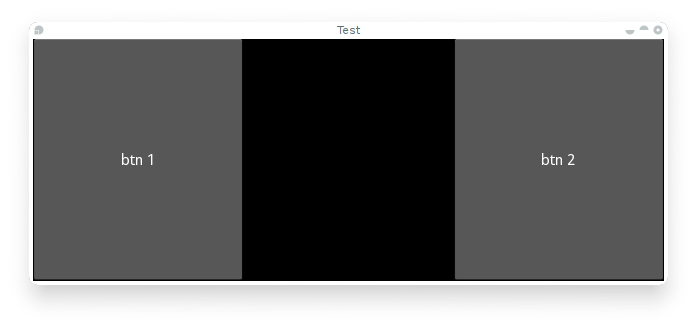

.. _events:
.. _properties:

Events and Properties
=====================

Events are a big part of kivy programming, that may not be surprising to those
having done GUI development before, but it's an important concept to get for
newcomers, and the specifics of how to use these in kivy. Once you understand
how events and ways to bind to them, are everywhere in kivy, it becomes easy to
build about whatever you want with kivy.

The following illustration tries to represent the relationship between the
events and the rest of kivy.

.. image:: images/Events.*

Introduction to Event Dispatcher
--------------------------------

One of the most important base classes of the framework is the
:class:`~kivy.event.EventDispatcher` class, this class allows to register event
types, and to dispatch them to interested parties (usually other event
dispatchers). :class:`~kivy.uix.widget.Widget`,
:class:`~kivy.animation.Animation` and :obj:`~kivy.clock.Clock` for example are
event dispatchers.

Creating custom events
----------------------

To create an event dispatcher with custom events, you need to register the name
of the event in the class, and to create a method of the same name.

See the following example::

    class MyEventDispatcher(EventDispatcher):
        def __init__(self, **kwargs):
            self.register_event_type('on_test')
            super(MyEventDispatcher, self).__init__(**kwargs)

        def do_something(self, value):
            # when do_something is called, the 'on_test' event will be
            # dispatched with the value
            self.dispatch('on_test', value)

        def on_test(self, *args):
            print "I am dispatched", args

Attaching callbacks
-------------------

To use events, you have to bind callbacks to them, when the event is
dispatched, your callbacks will be called with the various data the event has
to pass around.

A callback can be any python callable, but you need to be sure it can accept
the arguments the event will use, for this, it's usually safer to accept the
`*args` argument, that will catch any remaining arguments in the `args` list.

Example::

    def my_callback(value, *args):
        print "Hello, I got an event!", args

    ev = MyEventDispatcher()
    ev.bind(on_test=my_callback)
    ev.do_something('test')

Introduction to properties
--------------------------

Properties are an awesome way to define events and bind to them, it basically
produce events when the attributes of your object changes, so you can bind
actions to the change of these values.

There are different kind of properties to describe the type of data you want to
describe.

- :class:`~kivy.properties.StringProperty`
- :class:`~kivy.properties.NumericProperty`
- :class:`~kivy.properties.BoundedNumericProperty`
- :class:`~kivy.properties.ObjectProperty`
- :class:`~kivy.properties.DictProperty`
- :class:`~kivy.properties.ListProperty`
- :class:`~kivy.properties.OptionProperty`
- :class:`~kivy.properties.AliasProperty`
- :class:`~kivy.properties.BooleanProperty`
- :class:`~kivy.properties.ReferenceListProperty`

Declaration of a Property
-------------------------

To declare a property, you must create it at class level, the class will do the
work to instantiate the real attributes when the object will be created, the
properties is not the attribute, it's a mechanism to create events for your
attributes::

    class MyWidget(Widget):
    
        text = StringProperty('')

When overriding `__init__`, *always* accept `**kwargs` and use super() to call
the parents `__init__` with it::

        def __init__(self, **kwargs):
            super(MyWidget, self).__init__(**kwargs)

Dispatching a Property event
----------------------------

Kivy properties by default provide a on_<property_name> event. This event is
called when the value of the property is changed.

.. note::
    if the new value for the property is equal to the older value then the
    on_<property_name> event will not be called.

For example consider the following code.

.. code-block:: python
   :linenos:

    class CustomBtn(Widget):
    
        pressed = ListProperty([0, 0])
    
        def on_touch_down(self, touch):
            if self.collide_point(*touch.pos):
                self.pressed = touch.pos
                return True
            return super(CustomBtn, self).on_touch_down(touch)
    
        def on_pressed(self, instance, pos):
            print ('pressed at {pos}'.format(pos=pos))

In the code above at line: 3 ::

    pressed = ListProperty([0, 0])

We define  `pressed` Property of type :class:`~kivy.properties.ListProperty`,
giving it a default value of `[0, 0]`. from this point on-wards the `on_pressed`
event will be called when ever the value of this property is changed.

At Line 5::

    def on_touch_down(self, touch):
        if self.collide_point(*touch.pos):
            self.pressed = touch.pos
            return True
        return super(CustomBtn, self).on_touch_down(touch)

We override the :meth:`on_touch_down` method of the Widget class. Here we check
for collision of the `touch` with our widget. 

If it falls inside our widget, we change the value of `pressed` to touch.pos
and return True indicating that we have consumed the touch and don't want it
propagating any further.

Then finally if the touch falls outside our widget, we call the original event
using super(...)... and return the result so as to allow propagation of touch
to continue as it would otherwise have.

Finally on line 11::

    def on_pressed(self, instance, pos):
        print ('pressed at {pos}'.format(pos=pos))

We define `on_pressed` function that will be called by the property whenever the
property value is changed.

.. Note::
    This `on_<prop_name>` event is called within the class that the property is
    defined in. To monitor/observe the change to a property outside of a class
    it's defined in you should bind to the property.

**Binding to the property**

How to monitor changes to a property when all you have access to is a widget's
instance? You Bind to the property::

    your_widget_instance.bind(property_name=function_name)

For example consider the following code.

.. code-block:: python
   :linenos:

    class RootWidget(BoxLayout):
    
        def __init__(self, **kwargs):
            super(RootWidget, self).__init__(**kwargs)
            self.add_widget(Button(text='btn 1'))
            cb = CustomBtn()
            cb.bind(pressed=self.btn_pressed)
            self.add_widget(cb)
            self.add_widget(Button(text='btn 2'))
    
        def btn_pressed(self, instance, pos):
            print ('pos: printed from root widget: {pos}'.format(pos=.pos))

If you run the code as is you will notice two print statements in the console.
One from the `on_pressed` event that is called inside the `CustomBtn` class and
one from the `btn_pressed` function that we bind to the property change.

The reason that both the functions are called is simple. Binding doesn't mean
overriding. Having both of these functions is redundant and you should generally
only use one of the methods of listening/reacting to property changes.

You should also take note about the parameters that are passed to the 
on_<property_name> event or the function bound to the property.

.. code-block:: python

    def btn_pressed(self, instance, pos):

The first parameter is self which is the instance of the class this function is
defined in. If you use a in-line function like so.

.. code-block:: python
   :linenos:

    cb = CustomBtn()
    
    def _local_func(instance, pos):
        print ('pos: printed from root widget: {pos}'.format(pos=.pos))
    
    cb.bind(pressed=_local_func)
    self.add_widget(cb)

Then the first parameter would be `instance`  of the class the property is
defined in.

The last parameter is the `value` which is the new value of the property.

This is the complete runnable code derived from the snippets above that you can
use to copy and paste into a editor to experiment with.

.. code-block:: python
   :linenos:

    from kivy.app import App
    from kivy.uix.widget import Widget
    from kivy.uix.button import Button
    from kivy.uix.boxlayout import BoxLayout
    from kivy.properties import ListProperty

    class RootWidget(BoxLayout):

        def __init__(self, **kwargs):
            super(RootWidget, self).__init__(**kwargs)
            self.add_widget(Button(text='btn 1'))
            cb = CustomBtn()
            cb.bind(pressed=self.btn_pressed)
            self.add_widget(cb)
            self.add_widget(Button(text='btn 2'))

        def btn_pressed(self, instance, pos):
            print ('pos: printed from root widget: {pos}'.format(pos=pos))

    class CustomBtn(Widget):

        pressed = ListProperty([0, 0])

        def on_touch_down(self, touch):
            if self.collide_point(*touch.pos):
                self.pressed = touch.pos
                # we consumed the touch. return False here to propagate
                # the touch further to the children.
                return True
            return super(CustomBtn, self).on_touch_down(touch)

        def on_pressed(self, instance, pos):
            print ('pressed at {pos}'.format(pos=pos))

    class TestApp(App):

        def build(self):
            return RootWidget()

    if __name__ == '__main__':
        TestApp().run()

Running the code above will give you the following output.

Our CustomBtn has not visual representation and thus appears black. You can
touch/click on the black area to see the output on your console

Some Gotchas in AliasProperty and ReferenceListProperty.

While defining a AliasProperty you normally define a getter and a setter
function yourself. Here It falls on to you to define when the getter and the
setter functions are called using the `bind` argument.

Consider the following code.

.. code-block:: python
   :linenos:

   class TODO::
