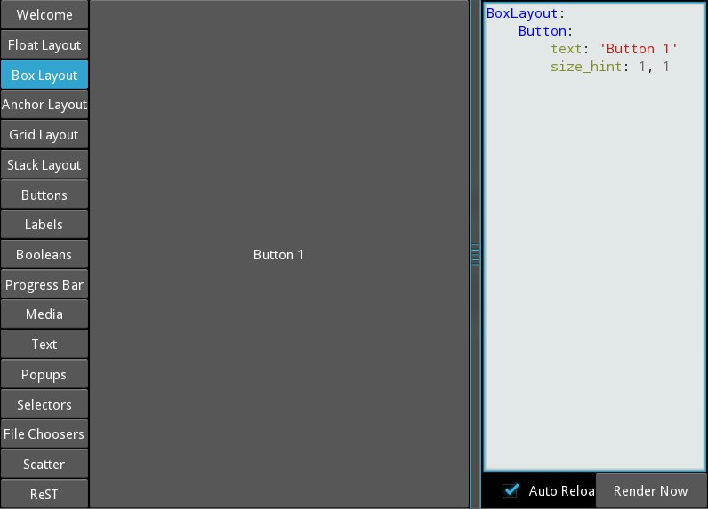
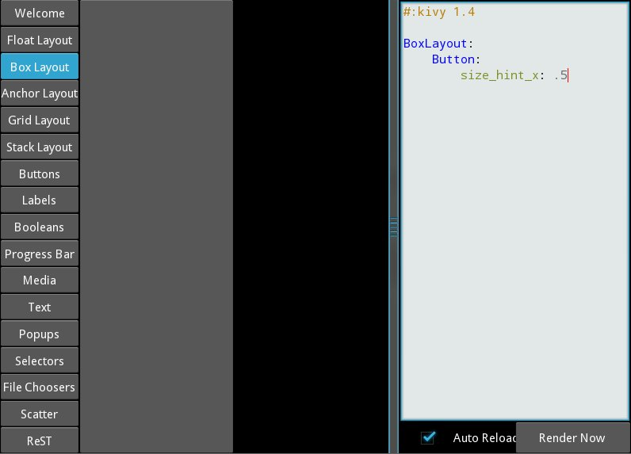
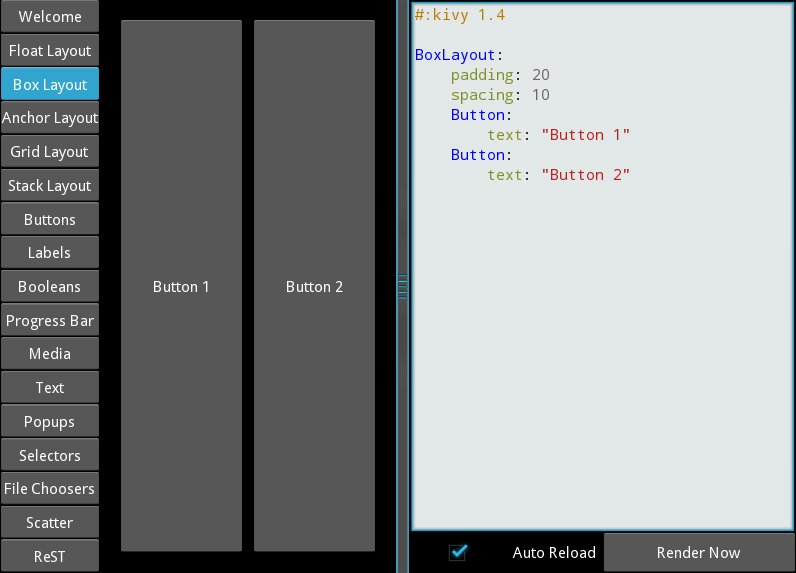
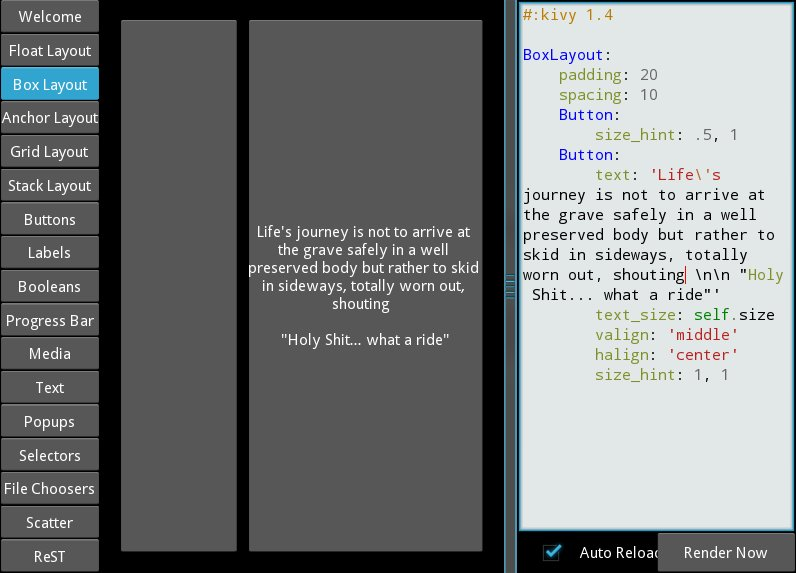

.. _widgets:

Widgets
=======

.. |size_hint| replace:: :attr:`~kivy.uix.widget.Widget.size_hint`
.. |pos_hint| replace:: :attr:`~kivy.uix.widget.Widget.pos_hint`
.. |size_hint_x| replace:: :attr:`~kivy.uix.widget.Widget.size_hint_x`
.. |size_hint_y| replace:: :attr:`~kivy.uix.widget.Widget.size_hint_y`
.. |pos| replace:: :attr:`~kivy.uix.widget.Widget.pos`
.. |size| replace:: :attr:`~kivy.uix.widget.Widget.size`
.. |width| replace:: :attr:`~kivy.uix.widget.Widget.width`
.. |height| replace:: :attr:`~kivy.uix.widget.Widget.height`
.. |children| replace:: :attr:`~kivy.uix.widget.Widget.children`
.. |parent| replace:: :attr:`~kivy.uix.widget.Widget.parent`
.. |x| replace:: :attr:`~kivy.uix.widget.Widget.x`
.. |y| replace:: :attr:`~kivy.uix.widget.Widget.y`
.. |left| replace:: :attr:`~kivy.uix.widget.Widget.left`
.. |top| replace:: :attr:`~kivy.uix.widget.Widget.top`
.. |center_x| replace:: :attr:`~kivy.uix.widget.Widget.center_x`
.. |center_y| replace:: :attr:`~kivy.uix.widget.Widget.center_y`
.. |orientation| replace:: :attr:`~kivy.uix.boxlayout.BoxLayout.orientation`
.. |Widget| replace:: :class:`~kivy.uix.widget.Widget`
.. |Button| replace:: :class:`~kivy.uix.button.Button`
.. |Canvas| replace:: :class:`~kivy.graphics.Canvas`
.. |ListProperty| replace:: :class:`~kivy.properties.ListProperty``
.. |ReferenceListProperty| replace:: :class:`~kivy.properties.ReferenceListProperty`
.. |Layout| replace:: :mod:`~kivy.uix.layout`
.. |RelativeLayout| replace:: :mod:`~kivy.uix.relativelayout`
.. |BoxLayout| replace:: :mod:`~kivy.uix.boxlayout`
.. |FloatLayout| replace:: :mod:`~kivy.uix.floatlayout`
.. |GridLayout| replace:: :mod:`~kivy.uix.gridlayout`
.. |StackLayout| replace:: :mod:`~kivy.uix.stacklayout`
.. |AnchorLayout| replace:: :mod:`~kivy.uix.anchorlayout`
.. |add_widget| replace:: :meth:`~kivy.uix.widget.Widget.add_widget`
.. |remove_widget| replace:: :meth:`~kivy.uix.widget.Widget.remove_widget`

Introduction to Widget
----------------------

A |Widget| can be termed as the base building block of a GUI interface in Kivy.
It provides a |Canvas| that can be used to draw on screen. It receives events
and reacts to them. For a in depth explanation about the |Widget| class,
Look at the module documentation.

Manipulating the Widget tree
----------------------------

Widgets are organized in Trees, your application has a `root widget`, which
usually has |children| that can have |children| on their own. Children of a
widget are represented as the |children| attribute which is a |ListProperty|.
For adding |children| to a |Widget|, call |add_widget|. Likewise, to remove a
widget, from its parent, call |remove_widget|.

Widgets don't influence the size/pos of their children by default, so the
|pos| attribute is the absolute position in screen co-ordinates (unless, of
course, you use the |RelativeLayout|, more on that later) and |size|, its
absolute size.

Organize with Layouts
---------------------

|Layout| is a special kind of widget that controls the size and position of
its children. There are different kinds of layouts, allowing for different
automatic organization of their children. Layouts use |size_hint| and |pos_hint|
properties to determine the |size| and |pos| of their |children|.

Look at the documentation of the various Layouts to see How they honor
|size_hint| and |pos_hint|:

- |FloatLayout|
- |BoxLayout|
- |GridLayout|
- |StackLayout|
- |RelativeLayout|
- |AnchorLayout|

|size_hint| is a |ReferenceListProperty| of
|size_hint_x| and |size_hint_y|. It excepts values from `0` to `1` or `None`
and defaults to `(1, 1)`. This signifies that if the widget is in a layout,
the layout will allocate it as much place as possible in both directions
(relative to the layouts size).

Setting |size_hint| to (0.5, 0.8) for example, will make the widget 50% the
width and 80% the height of available size for the |widget| inside a |layout|.

Consider the following example:

.. code-block:: kv

    BoxLayout:
        Button:
            text: 'Button 1'
            # default size_hint is 1, 1, we don't need to specify it explicitly
            # however it's provided here to make things clear
            size_hint: 1, 1

load kivy catalog::

    cd $KIVYDIR/examples/demo/kivycatalog
    python main.py

Replace $KIVYDIR with the directory of your installation of Kivy. Click on the
button labeled `Box Layout` from the left. Now paste the code from above into
the Editor on the right.

As you can see from the image above the `Button` takes up 100% of the layouts
|size|.

Changing the |size_hint_x|/|size_hint_y| to .5 will make the |widget| take 50%
of the |layout| |width|/|height|.

You can see here that although we specify |size_hint_x| and |size_hint_y| both
to be .5, only |size_hint_x| seems to be honored that's because |BoxLayout|
controls the |size_hint_y| when |orientation| is `vertical` and |size_hint_x|
when 'horizontal'. That means the controlled side's size is calculated depending
upon the total No. of |children| in the |BoxLayout|. Here that's one child with
|size_hint_y| controlled so, .5/.5 = 1. Thus the widget takes 100% of the parent
layout's height.

Let's add another |Button| to the |layout| and see what happens.

|BoxLayout| by its very nature devides the available space up between its
|children| equally, in our case that's 50-50 as we have two |children|. Let's
use size_hint on one of the children and see at the results.

If a child specifies |size_hint|, that specifies how much space the |Widget|
will take out of the |size| allotted to it by the |BoxLayout|. In our case the
first |Button| specifies .5 for |size_hint_x|. The space for the widget is
calculated like so::

    first child's size_hint devided by
    first child's size_hint + second child's size_hint + ...n(no of children)
    
    .5/().5+1) = .333...

The rest of the BoxLayouts |width| is divided among the rest of the |children|.
In our case that means the second |Button| takes up 66.66% of the |layout|
|width|.

Go ahead and experiment with |size_hint| to get comfortable with it.

If you want to control the absolute |size| of a |Widget|, you can set
|size_hint_x|/|size_hint_y| or both to `None` so that widgets |width| and or
|height| attributes will be honored.

|pos_hint| is a dict, which defaults to empty, As for |size_hint|, different
Layouts honor |pos_hint| differently, but you can add values to any of the |pos|
attributes (|x|, |y|, |left|, |top|, |center_x|, |center_y|) to have the
|Widget| positioned relatively to its |parent|.

Lets experiment with the following code in kivycatalog to understand |pos_hint|
visually:

.. code-block:: kv

    FloatLayout:
        Button:
            text: "We Will"
            pos: 100, 100
            size_hint: .2, .4
        Button:
            text: "Wee Wiill"
            pos: 200, 200
            size_hint: .4, .2

        Button:
            text: "ROCK YOU!!"
            pos_hint: {'x': .3, 'y': .6}
            size_hint: .5, .2

Should give us something that looks like this.

.. image:: images/pos_hint.jpg

You should experiment further with |pos_hint| by changing the values to
understand the effect they have on the widgets position.

Size and position metrics
-------------------------

.. |Transitions| replace:: :class:`~kivy.uix.screenmanager.TransitionBase`
.. |ScreenManager| replace:: :class:`~kivy.uix.screenmanager.ScreenManager`
.. |Screen| replace:: :class:`~kivy.uix.screenmanager.Screen`
.. |screen| replace:: :mod:`~kivy.modules.screen`
.. |metrics| replace:: :mod:`~kivy.metrics`
.. |pt| replace:: :attr:`~kivy.metrics.pt`
.. |mm| replace:: :attr:`~kivy.metrics.mm`
.. |cm| replace:: :attr:`~kivy.metrics.cm`
.. |in| replace:: :attr:`~kivy.metrics.in`
.. |dp| replace:: :attr:`~kivy.metrics.dp`
.. |sp| replace:: :attr:`~kivy.metrics.sp`

Kivys default unit for length is the pixel, all sizes and positions are
expressed in it by default. You can express them in other units, which is
useful to achieve better consistency across devices (they get converted to the
size in pixel automatically).

All available units are |pt|, |mm|, |cm|, |in|, |dp| and |sp|, you can see
about their usage in the |metrics| documentation.

On a related note, you can see the |screen| usage to simulate various devices
screens for your application.

Screen Separation with Screen Manager
-------------------------------------

If your application is composed of various screens, you likely want an easy
way to navigate from one |Screen| to another. Fortunately, there is
|ScreenManager| class, that allows you to define screens separately, and to set
the |Transitions| from one to another.
