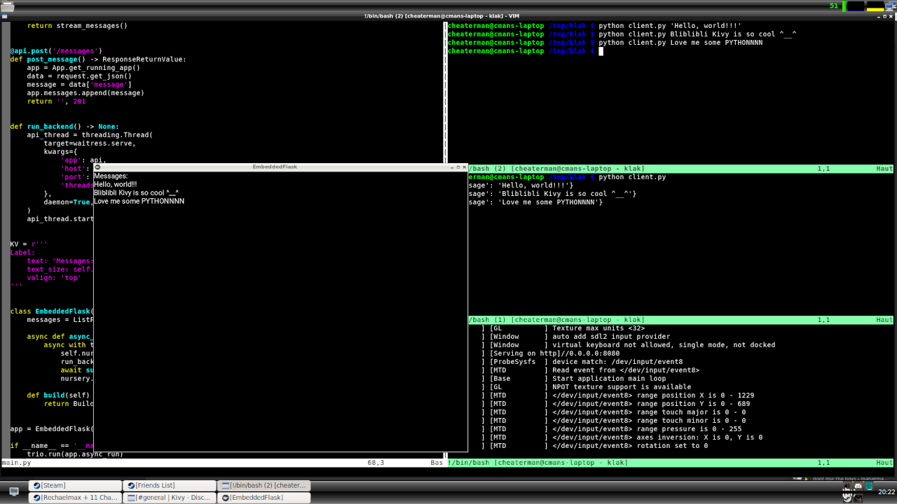

Embed Flask into a Kivy app (works on Windows too)
------------
An example on how to embed a Flask app into a Kivy one, and have them interact - and a test client as a bonus!

Python code (server)::

    import json
    import threading
    import time
    from collections.abc import Generator
    from typing import Any

    import trio
    import waitress  # type: ignore[import-untyped]
    from flask import Flask, request
    from flask.typing import ResponseReturnValue
    from kivy.app import App  # type: ignore[import-untyped]
    from kivy.lang.builder import Builder  # type: ignore[import-untyped]
    from kivy.properties import ListProperty  # type: ignore[import-untyped]

    api = Flask(__name__)

    @api.get('/messages')
    def message_stream() -> ResponseReturnValue:
        app = App.get_running_app()

        def stream_messages() -> Generator[str, None, None]:
            next_index = 0

            while True:
                for index, message in enumerate(
                    app.messages[next_index:],
                    start=next_index,
                ):
                    data = {'message': message}
                    yield f'data: {json.dumps(data)}\n\n'
                    next_index = index + 1

                time.sleep(1)
                yield ':heartbeat\n'

        return stream_messages()

    @api.post('/messages')
    def post_message() -> ResponseReturnValue:
        app = App.get_running_app()
        data = request.get_json()
        message = data['message']
        app.messages.append(message)
        return '', 201

    def run_backend() -> None:
        api_thread = threading.Thread(
            target=waitress.serve,
            kwargs={
                'app': api,
                'host': '0.0.0.0',
                'port': 8080,
                'threads': 256,
            },
            daemon=True,
        )
        api_thread.start()

    KV = r'''
    Label:
        text: 'Messages:\n{}'.format('\n'.join(app.messages))
        text_size: self.size
        valign: 'top'
    '''

    class EmbeddedFlask(App):  # type: ignore
        messages = ListProperty()

        async def async_run(self) -> None:
            async with trio.open_nursery() as nursery:
                self.nursery = nursery
                run_backend()
                await super().async_run(async_lib='trio')
                nursery.cancel_scope.cancel()

        def build(self) -> Any:
            return Builder.load_string(KV)

    app = EmbeddedFlask()

    if __name__ == '__main__':
        trio.run(app.async_run)

Python code (client)::

    """
    Usage:
    - python client.py - Listens to messages stream and displays the results
    - python client.py my message - Sends a new message to the backend
    """
    import json
    import sys
    from collections.abc import Sequence

    import requests  # type: ignore[import-untyped]

    API_URI = 'http://localhost:8080/messages'

    def main(args: Sequence[str]) -> None:
        if len(args) > 1:
            message = ' '.join(sys.argv[1:])
            requests.post(API_URI, json={'message': message})
            return

        for line in requests.get(API_URI, stream=True).iter_lines():
            data = line.decode('utf8').strip()

            if data.startswith(':'):
                continue

            command, _, payload = data.partition(':')

            if command != 'data':
                continue

            event = json.loads(payload)
            print(event)

    if __name__ == '__main__':
        main(sys.argv)

Streaming response using server-side-events for realtime communication.

Created by `Cheaterman <https://discord.com/channels/423249981340778496/1316848225692418068>`_ - December 12, 2024
