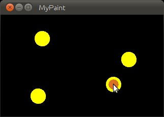
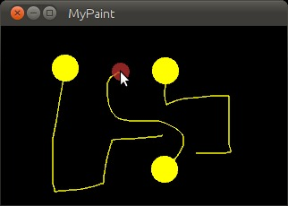
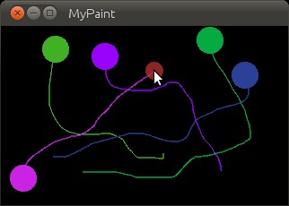
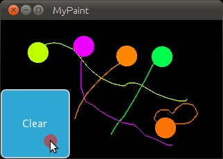

.. _firstwidget:

.. highlight:: python
   :linenothreshold: 3

A Simple Paint App
==================

In the following tutorial, you will be guided through the creation of your
first widget. This provides powerful and important knowledge when
programming Kivy applications, as it lets you create completely new user
interfaces with custom elements for your specific purpose.

Basic Considerations
--------------------

When creating an application, you have to ask yourself three important questions:

    * What data does my application process?
    * How do I visually represent that data?
    * How does the user interact with that data?

If you want to write a very simple line drawing application for example, you
most likely want the user to just draw on the screen with his/her fingers.
That's how the user *interacts* with your application. While doing so,
your application would memorize the positions where the user's finger were,
so that you can later draw lines between those positions. So the points
where the fingers were would be your *data* and the lines that you draw
between them would be your *visual representation*.

In Kivy, an application's user interface is composed of Widgets. Everything
that you see on the screen is somehow drawn by a widget. Often you would
like to be able to reuse code that you already wrote in a different
context, which is why widgets typically represent one specific instance
that answers the three questions above. A widget encapsulates data,
defines the user's interaction with that data and draws its visual
representation.
You can build anything from simple to complex user interfaces by
nesting widgets. There are many widgets built in, such as buttons, sliders
and other common stuff. In many cases, however, you need a custom widget
that is beyond the scope of what is shipped with Kivy (e.g. a
medical visualization widget).

So keep these three questions in mind when you design your widgets. Try to
write them in a minimal and reusable manner (i.e. a widget does exactly
what its supposed to do and nothing more. If you need more, write more
widgets or compose other widgets of smaller widgets. We try to adhere to the
`Single Responsibility Principle
<https://en.wikipedia.org/wiki/Single_responsibility_principle>`_).

Paint Widget
------------

We're sure one of your childhood dreams has always been creating your own
multitouch paint program. Allow us to help you achieve that. In the
following sections you will successively learn how to write a program like
that using Kivy. Make sure that you have read and understood
:ref:`quickstart`. You have? Great! Let's get started!

Initial Structure
~~~~~~~~~~~~~~~~~

Let's start by writing the very basic code structure that we need.  By the way,
all the different pieces of code that are used in this section are also
available in the ``examples/guide/firstwidget`` directory that comes with Kivy,
so you don't need to copy & paste it all the time.
Here is the basic code skeleton that we will need:

.. include:: ../../../examples/guide/firstwidget/1_skeleton.py
   :literal:

This is actually really simple. Save it as paint.py.
If you run it, you should only see a black screen.
As you can see, instead of using a built-in widget such as a Button (see
:ref:`quickstart`), we are going to write our own widget to do the drawing.
We do that by creating a class that inherits from
:class:`~kivy.uix.widget.Widget` (line 5-6) and although that class does nothing
yet, we can still treat it like a normal Kivy widget (line 11).
The ``if __name__ ...`` construct (line 14) is a Python mechanism that prevents
you from executing the code in the if-statement when importing from the file,
i.e. if you write ``import paint``, it won't do something unexpected but
just nicely provide the classes defined in the file.

.. note::
    You may be wondering why you have to import App and Widget separately,
    instead of doing something like ``from kivy import *``. While shorter,
    this would have the disadvantage of `polluting  your namespace
    <https://en.wikipedia.org/wiki/Namespace_%28computer_science%29#Python>`_
    and make the start of the application potentially much slower.
    It can also introduce ambiguity into class and variable naming,
    so is generally frowned upon in the Python community. The way we do it is
    faster and cleaner.

Adding Behaviour
~~~~~~~~~~~~~~~~

Let's now add some actual behaviour to the widget, i.e. make it react to user
input. Change the code like so:

.. include:: ../../../examples/guide/firstwidget/2_print_touch.py
   :literal:

This is just to show how easy it is to react to user input. When a
:class:`~kivy.input.motionevent.MotionEvent` (i.e. a touch, click, etc.) occurs,
we simply print the information about the touch object to the console.
You won't see anything on the screen, but if you observe the command-line from
which you are running the program, you will see a message for every touch.
This also demonstrates that a widget does not have to
have a visual representation.

Now that's not really an overwhelming user experience. Let's add some code
that actually draws something into our window:

.. include:: ../../../examples/guide/firstwidget/3_draw_ellipse.py
   :literal:

If you run your code with these modifications, you will see that every time
you touch, there will be a small yellow circle drawn where you touched.
How does it work?

    * Line 9: We use Python's ``with`` statement with the widget's
      :class:`~kivy.graphics.instructions.Canvas` object. This is like an
      area in which the widget can draw things to represent itself on the
      screen. By using the ``with`` statement with it, all successive
      drawing commands that are properly indented will modify this canvas.
      The ``with`` statement also makes sure that after our drawing,
      internal state can be cleaned up properly.
    * Line 10: You might have guessed it already: This sets the
      :class:`~kivy.graphics.context_instructions.Color` for successive
      drawing operations to yellow (default color format is RGB, so (1, 1, 0) is
      yellow). This is true until another
      :class:`~kivy.graphics.context_instructions.Color` is set.
      Think of this as dipping your brushes in that color, which you can
      then use to draw on a canvas until you dip the brushes into another color.
    * Line 11: We specify the diameter for the circle that we are about to
      draw. Using a variable for that is preferable since we need to refer
      to that value multiple times and we don't want to have to change it
      in several places if we want the circle bigger or smaller.
    * Line 12: To draw a circle, we simply draw an
      :class:`~kivy.graphics.vertex_instructions.Ellipse` with equal width
      and height. Since we want the circle to be drawn where the user
      touches, we pass the touch's position to the ellipse.
      Note that we need to shift the ellipse by ``-d/2`` in the x and y
      directions (i.e. left and downwards) because the position specifies the
      bottom left corner of the ellipse's bounding box, and we want it to be
      centered around our touch.

That was easy, wasn't it?
It gets better! Update the code to look like this:

.. include:: ../../../examples/guide/firstwidget/4_draw_line.py
   :literal:

This is what has changed:
    * Line 3: We now not only import the
      :class:`~kivy.graphics.vertex_instructions.Ellipse` drawing instruction,
      but also the :class:`~kivy.graphics.vertex_instructions.Line`
      drawing instruction. If you look at the documentation for
      :class:`~kivy.graphics.vertex_instructions.Line`, you will see that
      it accepts a ``points`` argument that has to be a list of 2D point
      coordinates, like ``(x1, y1, x2, y2, ..., xN, yN)``.
    * Line 13: This is where it gets interesting. ``touch.ud`` is a Python
      dictionary (type <dict>) that allows us to store *custom attributes*
      for a touch.
    * Line 13: We make use of the Line instruction that we imported and
      set a Line up for drawing. Since this is done in ``on_touch_down``,
      there will be a new line for every new touch. By creating the line
      inside the ``with`` block, the canvas automatically knows about the
      line and will draw it. We just want to modify the line later, so we
      store a reference to it in the ``touch.ud`` dictionary under the
      arbitrarily chosen but aptly named key 'line'.
      We pass the line that we're creating the initial touch position
      because that's where our line will begin.
    * Lines 15: We add a new method to our widget. This is similar to the
      ``on_touch_down`` method, but instead of being called when a *new*
      touch occurs, this method is being called when an *existing* touch
      (for which ``on_touch_down`` was already called) moves, i.e. its
      position changes. Note that this is the **same**
      :class:`~kivy.input.motionevent.MotionEvent` object with updated
      attributes. This is something we found incredibly handy and you will
      shortly see why.
    * Line 16: Remember: This is the same touch object that we got in
      ``on_touch_down``, so we can simply access the data we stored away
      in the ``touch.ud`` dictionary!
      To the line we set up for this touch earlier, we now add the current
      position of the touch as a new point. We know that we need to extend
      the line because this happens in ``on_touch_move``, which is only
      called when the touch has moved, which is exactly why we want to
      update the line.
      Storing the line in the ``touch.ud`` makes it a whole lot
      easier for us as we don't have to maintain our own touch-to-line
      bookkeeping.

So far so good. This isn't exactly beautiful yet, though. It looks a bit
like spaghetti bolognese. How about giving each touch its own color?
Great, let's do it:

.. include:: ../../../examples/guide/firstwidget/5_random_colors.py
   :literal:

Here are the changes:

    * Line 1: We import Python's random() function that will give us
      random values in the range of [0., 1.).
    * Line 10: In this case we simply create a new tuple of 3 random
      float values that will represent a random RGB color. Since we do
      this in ``on_touch_down``, every new touch will get its own color.
      Don't get confused by the use of
      `tuples <https://docs.python.org/2/tutorial/datastructures.html#tuples-and-sequences>`_.
      We're just binding the tuple to ``color`` for use as a shortcut
      within this method because we're lazy.
    * Line 12: As before, we set the color for the canvas. Only this time
      we use the random values we generated and feed them to the color
      class using Python's tuple unpacking syntax (since the Color class
      expects three individual color components instead of just 1. If we
      were to pass the tuple directly, that would be just 1 value being
      passed, regardless of the fact that the tuple itself contains 3
      values).

This looks a lot nicer already! With a lot of skill and patience, you
might even be able to create a nice little drawing!

.. note::
   Since by default the :class:`~kivy.graphics.context_instructions.Color`
   instructions assume RGB mode and we're feeding a tuple with three
   random float values to it, it might very well happen that we end up
   with a lot of dark or even black colors if we are unlucky. That would
   be bad because by default the background color is dark as well, so you
   wouldn't be able to (easily) see the lines you draw.
   There is a nice trick to prevent this: Instead of creating a tuple with
   three random values, create a tuple like this: ``(random(), 1., 1.)``.
   Then, when passing it to the color instruction, set the mode to HSV
   color space: ``Color(*color, mode='hsv')``. This way you will have a
   smaller number of possible colors, but the colors that you get will
   always be equally bright: only the hue changes.

Bonus Points
~~~~~~~~~~~~

At this point, we could say we are done. The widget does what it's
supposed to do: it traces the touches and draws lines. It even draws
circles at the positions where a line begins.

But what if the user wants to start a new drawing? With the current code,
the only way to clear the window would be to restart the entire application.
Luckily, we can do better. Let us add a *Clear* button that erases all the
lines and circles that have been drawn so far.
There are two options now:

    * We could either create the button as a child of our widget. That would
      imply that if you create more than one widget, every widget gets its own
      button. If you're not careful, this will also allow users to draw on top
      of the button, which might not be what you want.
    * Or we set up the button only once, initially, in our app class and
      when it's pressed we clear the widget.

For our simple example, it doesn't really matter that much. For larger
applications you should give some thought to who does what in your app.
We'll go with the second option here so that you see how you can build up
your application's widget tree in your app class's :meth:`~kivy.app.App.build`
method. We'll also change to the HSV color space (see preceding note):

.. include:: ../../../examples/guide/firstwidget/6_button.py
   :literal:

Here's what happens:

    * Line 4: We added an import statement to be able to use the
      :class:`~kivy.uix.button.Button` class.
    * Line 25: We create a dummy ``Widget()`` object as a parent for both
      our painting widget and the button we're about to add. This is just
      a poor-man's approach to setting up a widget tree hierarchy. We
      could just as well use a layout or do some other fancy stuff.
      Again: this widget does absolutely nothing except holding the two
      widgets we will now add to it as children.
    * Line 26: We create our ``MyPaintWidget()`` as usual, only this time
      we don't return it directly but bind it to a variable name.
    * Line 27: We create a button widget. It will have a label on it that
      displays the text 'Clear'.
    * Line 28: We then bind the button's on_release event (which is fired when
      the button is pressed and then released) to the
      `callback function <https://en.wikipedia.org/wiki/Callback_function#Python>`_
      `clear_canvas` defined on below on Lines 33 & 34.
    * Line 29 & 30: We set up the widget hierarchy by making both the
      painter and the clearbtn children of the dummy parent widget.
      That means `painter` and `clearbtn` are now siblings in the usual computer
      science tree terminology.
    * Line 33 & 34: Up to now, the button did nothing. It was there,
      visible, and you could press it, but nothing would happen.
      We change that here: we create a small, throw-away function that is
      going to be our
      `callback function <https://en.wikipedia.org/wiki/Callback_function#Python>`_
      when the button is pressed. The function just clears the painter's
      canvas' contents, making it black again.

.. note::
   The Kivy Widget class, by design, is kept simple. There are no general
   properties such as background color and border color. Instead, the examples
   and documentation illustrate how to easily handle such simple things
   yourself, as we have done here, setting the color for the canvas, and
   drawing the shape. From a simple start, you can move to more elaborate
   customization. Higher-level built-in widgets, deriving from Widget, such
   as Button, do have convenience properties such as background_color, but
   these vary by widget. Use the API docs to see what is offered by a widget,
   and subclass if you need to add more functionality.

Congratulations! You've written your first Kivy widget. Obviously this was
just a quick introduction. There is much more to discover. We suggest
taking a short break to let what you just learned sink in. Maybe draw some
nice pictures to relax? If you feel like you've understood everything and
are ready for more, we encourage you to read on.
