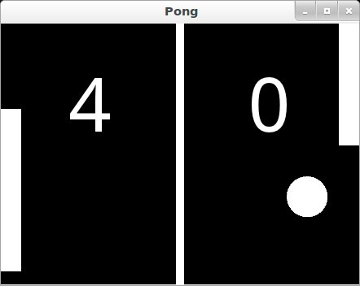

.. _pong:

.. highlight:: python
    :linenothreshold: 3

Pong Game Tutorial
==================

Introduction
------------

.. container:: title

    Welcome to the Pong tutorial

This tutorial will teach you how to write pong using Kivy. We'll start with
a basic application like the one described in the :ref:`quickstart` and turn
it into a playable pong game, describing each step along the way.

Here is a check list before starting this tutorial:

- You have a working Kivy installation. See the :doc:`/installation/installation`
  section for detailed descriptions
- You know how to run a basic Kivy application. See :ref:`quickstart`
  if you don't.

If you have read the programming guide, and understand both basic Widget
concepts (:doc:`/tutorials/firstwidget`) and basic concepts of the kv language
(:doc:`/guide/lang`), you can probably skip the first 2
steps and go straight to step 3.

.. note::

    You can find the entire source code, and source code files for each step in
    the Kivy examples directory under `tutorials/pong/`

Ready? Sweet, let's get started!

Getting Started
---------------

.. container:: title

    Getting Started

Let's start by getting a really simple Kivy app up and running. Create a
directory for the game and a file named *main.py*

.. include:: ../../../examples/tutorials/pong/steps/step1/main.py
    :literal:

Go ahead and run the application. It should just show a black window at this
point. What we've done is create a very simple Kivy :class:`~kivy.app.App`,
which creates an instance of our ``PongGame`` Widget class and returns it as
the root element for the applications UI, which you should imagine at this
point as a hierarchical tree of Widgets. Kivy places this widget-tree in the
default Window. In the next step, we will draw the
Pong background and scores by defining how the ``PongGame widget`` looks.

Add Simple Graphics
-------------------

.. container:: title

    Creation of pong.kv

We will use a .kv file to define the look and feel of the ``PongGame`` class.
Since our :class:`~kivy.app.App` class is called ``PongApp``, we can simply create a file
called ``pong.kv`` in the same directory that will be automatically loaded
when the application is run. So create a new file called *``pong.kv``* and add
the following contents.

.. literalinclude:: ../../../examples/tutorials/pong/steps/step2/pong.kv
    :language: kv
    :linenos:

.. note::

    COMMON ERROR: The name of the kv file, e.g. pong.kv, must match the name of the app,
    e.g. PongApp (the part before the App ending).

If you run the app now, you should see a vertical bar in the middle, and two
zeros where the player scores will be displayed.

Explaining the Kv File Syntax
~~~~~~~~~~~~~~~~~~~~~~~~~~~~~

Before going on to the next step, you might want to take a closer look at
the contents of the kv file we just created and figure out what is going on.
If you understand what's happening, you can probably skip ahead to the next
step.

On the very first line we have::

    #:kivy 1.0.9

This first line is required in every kv file. It should start with ``#:kivy``
followed by a space and the Kivy version it is intended for (so Kivy can make
sure you have at least the required version, or handle backwards compatibility
later on).

After that, we begin defining rules that are applied to all ``PongGame``
instances::

    <PongGame>:
        ...

Like Python, kv files use indentation to define nested blocks. A block defined
with a class name inside the ``<`` and ``>`` characters is a
:class:`~kivy.uix.widget.Widget` rule. It will be applied to any instance of
the named class. If you replaced ``PongGame`` with ``Widget`` in our example, all
Widget instances would have the vertical line and the two Label widgets inside
them because it would define these rules for all Widget instances.

Inside a rule section, you can add various blocks to define the style and
contents of the widgets they will be applied to. You can:

- set property values,
- add child widgets
- define a `canvas` section in which you can add Graphics instructions that
  define how the widget is rendered.

The first block inside the ``<PongGame>`` rule we have is a `canvas` block:

.. code-block:: kv

    <PongGame>:
        canvas:
            Rectangle:
                pos: self.center_x - 5, 0
                size: 10, self.height

So this canvas block says that the ``PongGame`` widget should draw some
graphics primitives. In this case, we add a rectangle to the canvas. We set
the pos of the rectangle to be 5 pixels left of the horizontal center of
the widget, and 0 for y. The size of the rectangle is set to 10 pixels
in width, and the widget's height in height. The nice thing about defining the
graphics like this, is that the rendered rectangle will be automatically
updated when the properties of any widgets used in the value expression change.

.. note::

    Try to resize the application window and notice what happens. That's
    right, the entire UI resizes automatically. The standard behaviour of the
    Window is to resize an element based on its property `size_hint`. The
    default widget size_hint is (1,1), meaning it will be stretched 100% in both
    x-direction and y-direction and hence fill the available space.
    Since the pos and size of the rectangle and center_x and top of the score
    labels were defined within
    the context of the ``PongGame`` class, these properties will automatically
    update when the corresponding widget properties change. Using the Kv
    language gives you automatic property binding. :)

The last two sections we add look pretty similar. Each of them adds a Label
widget as a child widget to the ``PongGame`` widget. For now, the text on
both of them is just set to *"0"*. We'll hook that up to the actual
score once we have the logic implemented, but the labels already
look good since we set a bigger font_size, and positioned them relatively
to the root widget. The ``root`` keyword can be used inside the child block to
refer back to the parent/root widget the rule applies to (``PongGame`` in this
case):

.. code-block:: kv

    <PongGame>:
        # ...

        Label:
            font_size: 70
            center_x: root.width / 4
            top: root.top - 50
            text: "0"

        Label:
            font_size: 70
            center_x: root.width * 3 / 4
            top: root.top - 50
            text: "0"

Add the Ball
------------

.. container:: title

    Add the Ball

Ok, so we have a basic pong arena to play in, but we still need the players and
a ball to hit around.  Let's start with the ball.  We'll add a new `PongBall`
class to create a widget that will be our ball and make it bounce around.

PongBall Class
~~~~~~~~~~~~~~

Here is the Python code for the PongBall class::

    class PongBall(Widget):

        # velocity of the ball on x and y axis
        velocity_x = NumericProperty(0)
        velocity_y = NumericProperty(0)

        # referencelist property so we can use ball.velocity as
        # a shorthand, just like e.g. w.pos for w.x and w.y
        velocity = ReferenceListProperty(velocity_x, velocity_y)

        # ``move`` function will move the ball one step. This
        #  will be called in equal intervals to animate the ball
        def move(self):
            self.pos = Vector(*self.velocity) + self.pos

And here is the kv rule used to draw the ball as a white circle:

.. code-block:: kv

    <PongBall>:
        size: 50, 50
        canvas:
            Ellipse:
                pos: self.pos
                size: self.size

To make it all work, you also have to add the imports for the
:doc:`/api-kivy.properties` Property classes used and the
:class:`~kivy.vector.Vector`.

Here is the entire updated python code and kv file for this step:

main.py:
    .. include:: ../../../examples/tutorials/pong/steps/step3/main.py
        :literal:

pong.kv:
    .. literalinclude:: ../../../examples/tutorials/pong/steps/step3/pong.kv
        :language: kv
        :linenos:

Note that not only a `<PongBall>` widget rule has been added, but also a
child widget `PongBall` in the `<PongGame>` widget rule.

Adding Ball Animation
---------------------

.. container:: title

    Making the ball move

Cool, so now we have a ball, and it even has a ``move`` function... but it's not
moving yet. Let's fix that.

Scheduling Functions on the Clock
~~~~~~~~~~~~~~~~~~~~~~~~~~~~~~~~~

We need the ``move`` method of our ball to be called regularly. Luckily, Kivy
makes this pretty easy by letting us schedule any function we want using the
:class:`~kivy.clock.Clock` and specifying the interval::

    Clock.schedule_interval(game.update, 1.0/60.0)

This line for example, would cause the ``update`` function of the game object to
be called once every 60th of a second (60 times per second).

Object Properties/References
~~~~~~~~~~~~~~~~~~~~~~~~~~~~

We have another problem though.  We'd like to make sure the PongBall has its
``move`` function called regularly, but in our code we don't have any references
to the ball object since we just added it via the kv file
inside the kv rule for the ``PongGame`` class. The only reference to our
game is the one we return in the applications build method.

Since we're going to have to do more than just move the ball (e.g.
bounce it off the walls and later the players racket), we'll probably need
an ``update`` method for our ``PongGame`` class anyway. Furthermore, given that
we have a reference to the game object already, we can easily schedule its new
``update`` method when the application gets built::

    class PongGame(Widget):

        def update(self, dt):
            # call ball.move and other stuff
            pass

    class PongApp(App):

        def build(self):
            game = PongGame()
            Clock.schedule_interval(game.update, 1.0/60.0)
            return game

However, that still doesn't change the fact that we don't have a reference to the
``PongBall`` child widget created by the kv rule.  To fix this, we can add an
:class:`ObjectProperty <kivy.properties.ObjectProperty>`
to the PongGame class, and hook it up to the widget created in
the kv rule. Once that's done, we can easily reference the ball property
inside the ``update`` method and even make it bounce off the edges::

    class PongGame(Widget):
        ball = ObjectProperty(None)

        def update(self, dt):
            self.ball.move()

            # bounce off top and bottom
            if (self.ball.y < 0) or (self.ball.top > self.height):
                self.ball.velocity_y *= -1

            # bounce off left and right
            if (self.ball.x < 0) or (self.ball.right > self.width):
                self.ball.velocity_x *= -1

Don't forget to hook it up in the kv file, by giving the child widget an id
and setting the PongGame's ``ball`` ObjectProperty to that id:

.. code-block:: kv

    <PongGame>:
        ball: pong_ball

        # ... (canvas and Labels)

        PongBall:
            id: pong_ball
            center: self.parent.center

.. note::

    At this point everything is hooked up for the ball to bounce around. If
    you're coding along as we go, you might be wondering why the ball isn't
    moving anywhere.  The ball's velocity is set to 0 on both x and y.
    In the code listing below, a ``serve_ball`` method is
    added to the ``PongGame`` class and called in the app's ``build`` method. It sets a
    random x and y velocity for the ball, and also resets the position, so we
    can use it later to reset the ball when a player has scored a point.

Here is the entire code for this step:

main.py:
   .. include:: ../../../examples/tutorials/pong/steps/step4/main.py
    :literal:

pong.kv:
   .. literalinclude:: ../../../examples/tutorials/pong/steps/step4/pong.kv
    :language: kv
    :linenos:

Connect Input Events
--------------------

.. container:: title

    Adding Players and reacting to touch input

Sweet, our ball is bouncing around. The only things missing now are the movable
player rackets and keeping track of the score.  We won't go over all the
details of creating the class and kv rules again, since those concepts were
already covered in the previous steps. Instead, let's focus on how to move the
Player widgets in response to user input. You can get the whole code and kv
rules for the ``PongPaddle`` class at the end of this section.

In Kivy, a widget can react to input by implementing the
:meth:`on_touch_down <kivy.uix.widget.Widget.on_touch_down>`, the
:meth:`on_touch_move <kivy.uix.widget.Widget.on_touch_move>` and the 
:meth:`on_touch_up <kivy.uix.widget.Widget.on_touch_up>`
methods. By default, the Widget class
implements these methods by just calling the corresponding method on all its
child widgets to pass on the event until one of the children returns ``True``.

Pong is pretty simple. The rackets just need to move up and down. In fact it's
so simple, we don't even really need to have the player widgets handle the
events themselves. We'll just implement the ``on_touch_move`` function for the
``PongGame`` class and have it set the position of the left or right player based
on whether the touch occurred on the left or right side of the screen.

Check the ``on_touch_move`` handler::

    def on_touch_move(self, touch):
        if touch.x < self.width/3:
            self.player1.center_y = touch.y
        if touch.x > self.width - self.width/3:
            self.player2.center_y = touch.y

We'll keep the score for each player in a
:class:`~kivy.properties.NumericProperty`. The score labels of the ``PongGame``
are kept updated by changing the NumericProperty ``score``, which in turn
updates the ``PongGame`` child labels text property. This binding
occurs because Kivy :mod:`~kivy.properties` automatically bind to any references
in their corresponding kv files. When the ball
escapes out of the sides, we'll update the score and serve the ball
again by changing the ``update`` method in the ``PongGame`` class. The ``PongPaddle``
class also implements a ``bounce_ball method``, so that the ball bounces
differently based on where it hits the racket. Here is the code for the
`PongPaddle` class::

    class PongPaddle(Widget):

        score = NumericProperty(0)

        def bounce_ball(self, ball):
            if self.collide_widget(ball):
                speedup  = 1.1
                offset = 0.02 * Vector(0, ball.center_y-self.center_y)
                ball.velocity =  speedup * (offset - ball.velocity)

.. note::

    This algorithm for ball bouncing is very simple, but will have strange behavior
    if the ball hits the paddle from the side or bottom...this is something you could
    try to fix yourself if you like.

And here it is in context. Pretty much done:

main.py:
   .. include:: ../../../examples/tutorials/pong/steps/step5/main.py
    :literal:

pong.kv:

   .. literalinclude:: ../../../examples/tutorials/pong/steps/step5/pong.kv
    :language: kv
    :linenos:

Where To Go Now?
----------------

.. container:: title

    Have some fun

Well, the pong game is pretty much complete. If you understood all of the
things that are covered in this tutorial, give yourself a pat on the back and
think about how you could improve the game. Here are a few ideas of things
you could do:

* Add some nicer graphics / images. (Hint: check out the
  :attr:`~kivy.graphics.instructions.VertexInstruction.source` property on
  the graphics instructions like :attr:`~kivy.graphics.Line.circle` or
  :class:`~kivy.graphics.Rectangle`, to set an image as the
  texture.)

* Make the game end after a certain score. Maybe once a player has 10
  points, you can display a large "PLAYER 1 WINS" label and/or add a main menu
  to start, pause and reset the game. (Hint: check out the
  :class:`~kivy.uix.button.Button` and
  :class:`~kivy.uix.label.Label`
  classes, and figure out how to use their `add_widget` and `remove_widget`
  functions to add or remove widgets dynamically.

* Make it a 4 player Pong Game.  Most tablets have Multi-Touch support, so
  wouldn't it be cool to have a player on each side and have four 
  people play at the same time?

* Fix the simplistic collision check so hitting the ball with an end of
  the paddle results in a more realistic bounce.

.. note::

    You can find the entire source code and source code files for each step in
    the Kivy examples directory under tutorials/pong/
