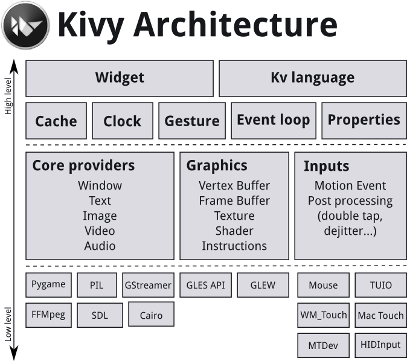

.. _architecture:

Architectural Overview
======================

We would like to take a moment to explain how we designed Kivy from a
software engineering point of view. This is key to understanding how
everything works together.
If you just look at the code, chances are you will get a rough idea
already, but since this approach certainly is daunting for most users,
this section explains the basic ideas of the implementation in more detail.
You can skip this section and refer to it later, but we suggest at least
skimming it for a rough overview.

Kivy consists of several building blocks that we will explain shortly. Here is a
graphical summary of the architecture:

.. _providers:

Core Providers and Input Providers
----------------------------------

One idea that is key to understanding Kivy's internals is that of modularity and
abstraction. We try to abstract basic tasks such as opening a window,
displaying images and text, playing audio, getting images from a camera,
spelling correction and so on. We call these *core* tasks.
This makes the API both easy to use and easy to extend. Most importantly, it
allows us to use -- what we call -- specific providers for the respective
scenarios in which your app is being run.
For example, on macOS, Linux, *BSD Unix and Windows, there are different native
APIs for the different core tasks. A piece of code that uses one of these specific
APIs to talk to the operating system on one side and to Kivy on the other (acting
as an intermediate communication layer) is what we call a *core provider*.
The advantage of using specialized core providers for each platform is that we
can fully leverage the functionality exposed by the operating system and act as
efficiently as possible. It also gives users a choice. Furthermore, by using
libraries that are shipped with any one platform, we effectively reduce the size
of the Kivy distribution and make packaging easier. This also makes it easier to port
Kivy to other platforms. The Android port benefited greatly from this.

We follow the same concept with input handling. *An input provider* is a piece
of code that adds support for a specific input device, such as Apple's
trackpads, TUIO or a mouse emulator.
If you need to add support for a new input device, you can simply provide a new
class that reads your input data from your device and transforms them into Kivy
basic events.

Graphics
--------

Kivy's graphics API is our abstraction of OpenGL. On the lowest level,
Kivy issues hardware-accelerated drawing commands using OpenGL. Writing
OpenGL code however can be a bit confusing, especially to newcomers.
That's why we provide the graphics API that lets you draw things using
simple metaphors that do not exist as such in OpenGL (e.g. Canvas,
Rectangle, etc.).

All of our widgets themselves use this graphics API, which is implemented
on the C level for performance reasons.

Another advantage of the graphics API is its ability to automatically
optimize the drawing commands that your code issues. This is especially
helpful if you're not an expert at tuning OpenGL. This makes your drawing
code more efficient in many cases.

You can, of course, still use raw OpenGL commands if you prefer. The
version we target is OpenGL 2.0 ES (GLES2) on all devices, so if you want to
stay cross-platform compatible, we advise you to only use the GLES2 functions.

Core
----

The code in the core package provides commonly used features, such as:

    Clock
        You can use the clock to schedule timer events. Both one-shot timers
        and periodic timers are supported.

    Cache
        If you need to cache something that you use often, you can use our
        class for that instead of writing your own.

    Gesture Detection
        We ship a simple gesture recognizer that you can use to detect
        various kinds of strokes, such as circles or rectangles. You can
        train it to detect your own strokes.

    Kivy Language
        The kivy language is used to easily and efficiently describe user
        interfaces.

    Properties
        These are not the normal properties that you may know from python.
        They are our own property classes that link your widget code with
        the user interface description.

UIX (Widgets & Layouts)
-----------------------

The UIX module contains commonly used widgets and layouts that you can
reuse to quickly create a user interface.

    Widgets
        Widgets are user interface elements that you add to your program
        to provide some kind of functionality. They may or may not be
        visible. Examples would be a file browser, buttons, sliders, lists
        and so on. Widgets receive MotionEvents.

    Layouts
        You use layouts to arrange widgets. It is of course possible to
        calculate your widgets' positions yourself, but often it is more
        convenient to use one of our ready made layouts. Examples would be
        Grid Layouts or Box Layouts.
        You can also nest layouts.

Modules
-------

If you've ever used a modern web browser and customized it with some
add-ons then you already know the basic idea behind our module classes.
Modules can be used to inject functionality into Kivy programs, even if
the original author did not include it.

An example would be a module that always shows the FPS of the current
application and some graph depicting the FPS over time.

You can also write your own modules.

Input Events (Touches)
----------------------

Kivy abstracts different input types and sources such as touches, mice,
TUIO or similar. What all of these input types have in common is that you
can associate a 2D onscreen-position with any individual input event. (There are
other input devices such as accelerometers where you cannot easily find a
2D position for e.g. a tilt of your device. This kind of input is handled
separately. In the following we describe the former types.)

All of these input types are represented by instances of the Touch()
class. (Note that this does not only refer to finger touches, but all the other
input types as well. We just called it *Touch* for the sake of simplicity.
Think of it of something that *touches* the user interface or your screen.)
A touch instance, or object, can be in one of three states. When a touch
enters one of these states, your program is informed that the event
occurred.
The three states a touch can be in are:

    Down
        A touch is down only once, at the very moment where it first
        appears.
    Move
        A touch can be in this state for a potentially unlimited time.
        A touch does not have to be in this state during its lifetime.
        A 'Move' happens whenever the 2D position of a touch changes.
    Up
        A touch goes up at most once, or never.
        In practice you will almost always receive an up event because
        nobody is going to hold a finger on the screen for all eternity,
        but it is not guaranteed. If you know the input sources your users
        will be using, you will know whether or not you can rely on this
        state being entered.

Widgets and Event Dispatching
-----------------------------

The term *widget* is often used in GUI programming contexts to describe
some part of the program that the user interacts with.
In Kivy, a widget is an object that receives input events. It does not
necessarily have to have a visible representation on the screen.
All widgets are arranged in a *widget tree* (which is a tree data structure
as known from computer science classes): One widget can have any number of
child widgets or none. There is exactly one *root widget* at the top of the
tree that has no parent widget, and all other widgets are directly or
indirectly children of this widget (which is why it's called the root).

When new input data is available, Kivy sends out one event per touch.
The root widget of the widget tree first receives the event.
Depending on the state of the touch, the on_touch_down,
on_touch_move or on_touch_up event is dispatched (with the touch as the
argument) to the root widget, which results in the root widget's
corresponding on_touch_down, on_touch_move or on_touch_up event handler
being called.

Each widget (this includes the root widget) in the tree can choose to
either digest or pass the event on. If an event handler returns True,
it means that the event has been digested and handled properly. No further
processing will happen with that event. Otherwise, the event handler
passes the widget on to its own children by calling its superclass's
implementation of the respective event handler. This goes all the way up
to the base Widget class, which -- in its touch event handlers -- does
nothing but pass the touches to its children::

    # This is analogous for move/up:
    def on_touch_down(self, touch):
        for child in self.children[:]:
            if child.dispatch('on_touch_down', touch):
                return True

This really is much easier than it first seems. An example of how this can
be used to create nice applications quickly will be given in the following
section.

Often times you will want to restrict the *area* on the screen that a
widget watches for touches. You can use a widget's collide_point() method
to achieve this. You simply pass it the touch's position and it returns
True if the touch is within the 'watched area' or False otherwise. By
default, this checks the rectangular region on the screen that's described
by the widget's pos (for position; x & y) and size (width & height), but
you can override this behaviour in your own class.

