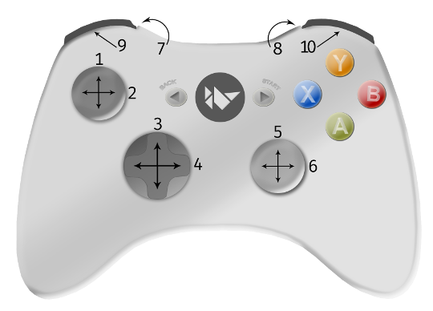

Input management
================

Input architecture
------------------

Kivy is able to handle most types of input: mouse, touchscreen, accelerometer,
gyroscope, etc. It handles the native multitouch protocols on the following
platforms: Tuio, WM_Touch, MacMultitouchSupport, MT Protocol A/B and Android.

The global architecture can be viewed as::

    Input providers -> Motion event -> Post processing -> Dispatch to Window

The class of all input events is the
:class:`~kivy.input.motionevent.MotionEvent`. It generates 2 kinds of
events:

    - Touch events: a motion event that contains at least an X and Y position.
      All the touch events are dispatched across the Widget tree.
    - No-touch events: all the rest. For example, the accelerometer is a
      continuous event, without position. It never starts or stops. These events
      are not dispatched across the Widget tree.

A Motion event is generated by an :mod:`Input Provider <kivy.input.providers>`.
An Input Provider is responsible for reading the input event from the operating
system, the network or even from another application. Several input providers
exist, such as:

    - :class:`~kivy.input.providers.tuio.TuioMotionEventProvider`: create a
      UDP server and listen for TUIO/OSC messages.
    - :class:`~kivy.input.providers.wm_touch.WM_MotionEventProvider`: use the
      windows API for reading multitouch information and sending it to Kivy.
    - :class:`~kivy.input.providers.probesysfs.ProbeSysfsHardwareProbe`:
      In Linux, iterate over all the hardware connected to the computer, and
      attaches a multitouch input provider for each multitouch device found.
    - and much more!

When you write an application, you don't need to create an input provider. Kivy
tries to automatically detect available hardware. However, if you want to
support custom hardware, you will need to configure kivy to make it work.

Before the newly-created Motion Event is passed to the user, Kivy applies
post-processing to the input. Every motion event is analyzed to detect and
correct faulty input, as well as make meaningful interpretations like:

    - Double/triple-tap detection, according to a distance and time threshold
    - Making events more accurate when the hardware is not accurate
    - Reducing the amount of generated events if the native touch hardware is
      sending events with nearly the same position

After processing, the motion event is dispatched to the Window. As explained
previously, not all events are dispatched to the whole widget tree: the window
filters them. For a given event:

    - if it's only a motion event, it will be dispatched to
      :meth:`~kivy.core.window.WindowBase.on_motion`
    - if it's a touch event, the (x,y) position of the touch (0-1 range) will be
      scaled to the Window size (width/height), and dispatched to:

      - :meth:`~kivy.uix.widget.Widget.on_touch_down`
      - :meth:`~kivy.uix.widget.Widget.on_touch_move`
      - :meth:`~kivy.uix.widget.Widget.on_touch_up`

Motion event profiles
---------------------

Depending on your hardware and the input providers used, more information may be
made available to you. For example, a touch input has an (x,y) position, but
might also have pressure information, blob size, an acceleration vector, etc.

A profile is a string that indicates what features are available inside the
motion event. Let's imagine that you are in an ``on_touch_move`` method::

    def on_touch_move(self, touch):
        print(touch.profile)
        return super(..., self).on_touch_move(touch)

The print could output::

    ['pos', 'angle']

.. warning::

    Many people mix up the profile's name and the name of the corresponding
    property. Just because ``'angle'`` is in the available profile doesn't
    mean that the touch event object will have an ``angle`` property.

For the ``'pos'`` profile, the properties ``pos``, ``x``, and ``y`` will be
available. With the ``'angle'`` profile, the property ``a`` will be available.
As we said, for touch events ``'pos'`` is a mandatory profile, but not
``'angle'``. You can extend your interaction by checking if the ``'angle'``
profile exists::

    def on_touch_move(self, touch):
        print('The touch is at position', touch.pos)
        if 'angle' in touch.profile:
            print('The touch angle is', touch.a)

You can find a list of available profiles in the
:mod:`~kivy.input.motionevent` documentation.

Touch events
------------

A touch event is a specialized :class:`~kivy.input.motionevent.MotionEvent`
where the property :attr:`~kivy.input.motionevent.MotionEvent.is_touch`
evaluates to True. For all touch events, you automatically have the X and Y
positions available, scaled to the Window width and height. In other words, all
touch events have the ``'pos'`` profile.

Touch event basics
~~~~~~~~~~~~~~~~~~

By default, touch events are dispatched to all currently displayed widgets.
This means widgets receive the touch event whether it occurs within their
physical area or not.

This can be counter intuitive if you have experience with other GUI toolkits.
These typically divide the screen into geometric areas and only dispatch
touch or mouse events to the widget if the coordinate lies within the
widgets area.

This requirement becomes very restrictive when working with touch input.
Swipes, pinches and long presses may well originate from outside of the widget
that wants to know about them and react to them.

In order to provide the maximum flexibility, Kivy dispatches the events to
all the widgets and lets them decide how to react to them. If you only want
to respond to touch events inside the widget, you simply check::

    def on_touch_down(self, touch):
        if self.collide_point(*touch.pos):
            # The touch has occurred inside the widgets area. Do stuff!
            pass

Coordinates
~~~~~~~~~~~

You must take care of matrix transformation in your touch as soon as you use
a widget with matrix transformation. Some widgets such as
:class:`~kivy.uix.scatter.Scatter` have their own matrix transformation,
meaning the touch must be multiplied by the scatter
matrix to be able to correctly dispatch touch positions to the Scatter's
children.

    - Get coordinate from parent space to local space:
      :meth:`~kivy.uix.widget.Widget.to_local`
    - Get coordinate from local space to parent space:
      :meth:`~kivy.uix.widget.Widget.to_parent`
    - Get coordinate from local space to window space:
      :meth:`~kivy.uix.widget.Widget.to_window`
    - Get coordinate from window space to local space:
      :meth:`~kivy.uix.widget.Widget.to_widget`

You must use one of them to scale coordinates correctly to the context.
Let's look the scatter implementation::

    def on_touch_down(self, touch):
        # push the current coordinate, to be able to restore it later
        touch.push()

        # transform the touch coordinate to local space
        touch.apply_transform_2d(self.to_local)

        # dispatch the touch as usual to children
        # the coordinate in the touch is now in local space
        ret = super(..., self).on_touch_down(touch)

        # whatever the result, don't forget to pop your transformation
        # after the call, so the coordinate will be back in parent space
        touch.pop()

        # return the result (depending what you want.)
        return ret

Touch shapes
~~~~~~~~~~~~

If the touch has a shape, it will be reflected in the 'shape' property. Right
now, only a :class:`~kivy.input.shape.ShapeRect` can be exposed::

    from kivy.input.shape import ShapeRect

    def on_touch_move(self, touch):
        if isinstance(touch.shape, ShapeRect):
            print('My touch have a rectangle shape of size',
                (touch.shape.width, touch.shape.height))
        # ...

Double tap
~~~~~~~~~~

A double tap is the action of tapping twice within a time and a distance.
It's calculated by the doubletap post-processing module. You can test if the
current touch is one of a double tap or not::

    def on_touch_down(self, touch):
        if touch.is_double_tap:
            print('Touch is a double tap !')
            print(' - interval is', touch.double_tap_time)
            print(' - distance between previous is', touch.double_tap_distance)
        # ...

Triple tap
~~~~~~~~~~

A triple tap is the action of tapping thrice within a time and a distance.
It's calculated by the tripletap post-processing module. You can test if the
current touch is one of a triple tap or not::

    def on_touch_down(self, touch):
        if touch.is_triple_tap:
            print('Touch is a triple tap !')
            print(' - interval is', touch.triple_tap_time)
            print(' - distance between previous is', touch.triple_tap_distance)
        # ...

Grabbing touch events
~~~~~~~~~~~~~~~~~~~~~

It's possible for the parent widget to dispatch a touch event to a child
widget from within ``on_touch_down``, but not from ``on_touch_move`` or
``on_touch_up``. This can happen in certain scenarios, like when a touch
movement is outside the bounding box of the parent, so the parent decides not to
notify its children of the movement.

But you might want to do something in ``on_touch_up``. Say you started something in
the ``on_touch_down`` event, like playing a sound, and you'd like to finish things
on the ``on_touch_up`` event. Grabbing is what you need.

When you grab a touch, you will always receive the move and up event. But there
are some limitations to grabbing:

    - You will receive the event at least twice: one time from your parent (the
      normal event), and one time from the window (grab).
    - You might receive an event with a grabbed touch, but not from you: it can be
      because the parent has sent the touch to its children while it was in
      the grabbed state.

Here is an example of how to use grabbing::

    def on_touch_down(self, touch):
        if self.collide_point(*touch.pos):

            # if the touch collides with our widget, let's grab it
            touch.grab(self)

            # and accept the touch.
            return True

    def on_touch_up(self, touch):
        # here, you don't check if the touch collides or things like that.
        # you just need to check if it's a grabbed touch event
        if touch.grab_current is self:

            # ok, the current touch is dispatched for us.
            # do something interesting here
            print('Hello world!')

            # don't forget to ungrab ourself, or you might have side effects
            touch.ungrab(self)

            # and accept the last up
            return True

Touch Event Management
~~~~~~~~~~~~~~~~~~~~~~

In order to see how touch events are controlled and propagated between
widgets, please refer to the
:ref:`Widget touch event bubbling <widget-event-bubbling>` section.

Joystick events
---------------

A joystick input represents raw values received directly from physical
or virtual controllers through the SDL2 provider via these events:

* SDL_JOYAXISMOTION
* SDL_JOYHATMOTION
* SDL_JOYBALLMOTION
* SDL_JOYBUTTONDOWN
* SDL_JOYBUTTONUP

Every motion event has a minimum, maximum and default value which
can reach:

+-------------+----------+---------+---------+
| Event       | Minimum  | Maximum | Default |
+=============+==========+=========+=========+
| on_joy_axis | -32767   |  32767  |    0    |
+-------------+----------+---------+---------+
| on_joy_hat  | (-1, -1) |  (1, 1) |  (0, 0) |
+-------------+----------+---------+---------+
| on_joy_ball | Unknown  | Unknown | Unknown |
+-------------+----------+---------+---------+

Button events, on the other hand represent basically only a state of each
button i.e. `up` and `down`, therefore no such values are present.

* on_joy_button_up
* on_joy_button_down

Joystick event basics
~~~~~~~~~~~~~~~~~~~~~

.. |dropexpl| replace:: Multiple dropfile example
.. _dropexpl:
   https://github.com/kivy/kivy/blob/master/examples/miscellaneous/multiple_dropfile.py

Unlike touch events, joystick events are dispatched directly to the Window,
which means there's only a single value passed for e.g. a specified axis,
not multiple ones. This makes things harder if you want to separate input
to different widgets, yet not impossible. You can use |dropexpl|_ as an
inspiration.

To get a joystick event, you first need to bind some function to the Window
joystick event like this::

    Window.bind(on_joy_axis=self.on_joy_axis)

Then you need to fetch the parameters specified in
:class:`~kivy.core.window.Window` for each event you use, for example::

    def on_joy_axis(self, win, stickid, axisid, value):
        print(win, stickid, axisid, value)

A variable `stickid` is an id of a controller that sent the value, `axisid` is
an id of an axis to which the value belongs.

Joystick input
~~~~~~~~~~~~~~

Kivy should be able to fetch input from any device specified as `gamepad`,
`joystick` or basically any other type of game controller recognized by the SDL2
provider. To make things easier, here are layouts of some common controllers
together with ids for each part.

Xbox 360
^^^^^^^^

+------------+------+---------+-----+--------+
|            |  #   |ID       |  #  | ID     |
|            +------+---------+-----+--------+
|            |  1   |axis 1   |  2  |axis 0  |
|            +------+---------+-----+--------+
|            |  3   |hat Y    |  4  |hat X   |
|            +------+---------+-----+--------+
|            |  5   |axis 4   |  6  |axis 3  |
|            +------+---------+-----+--------+
|            |  7   |axis 2   |  8  |axis 5  |
| |xbox_ctr| +------+---------+-----+--------+
|            |  9   |button 4 | 10  |button 5|
|            +------+---------+-----+--------+
|            |  X   |button 2 |  Y  |button 3|
|            +------+---------+-----+--------+
|            |  A   |button 0 |  B  |button 1|
|            +------+---------+-----+--------+
|            | back |button 6 |start|button 7|
|            +------+---------+-----+--------+
|            |center|button 10|     |        |
+------------+------+---------+-----+--------+

Joystick debugging
~~~~~~~~~~~~~~~~~~

.. |vjoy| replace:: vJoy
.. _vjoy: http://vjoystick.sourceforge.net

Mostly you'd want to debug your application with multiple controllers, or
test it against _other_ types of controllers (e.g. different brands).
As an alternative you might want to use some of the available
controller emulators, such as |vjoy|_.
